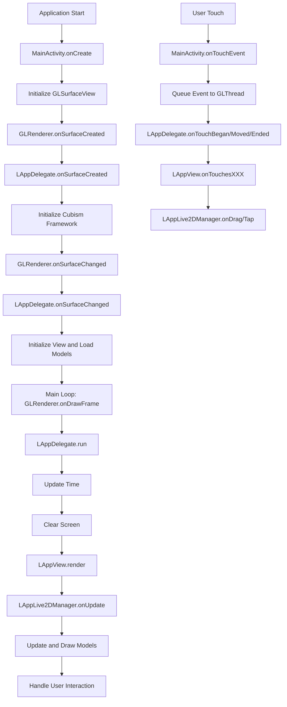

# Live2D SDK Sample 示例分析

## 1. 整体架构分析

### 1.1 目录结构
Live2D SDK Sample 包含两个主要示例：
- `full` - 完整功能示例，支持多模型切换、复杂交互等
- `minimum` - 最小化示例，只展示基本功能

### 1.2 核心组件
1. **LAppDelegate/LAppMinimumDelegate** - 应用程序委托类，负责初始化和管理整个应用生命周期
2. **LAppLive2DManager/LAppMinimumLive2DManager** - 模型管理器，负责加载和管理模型
3. **LAppModel/LAppMinimumModel** - 模型类，封装单个Live2D模型的所有功能
4. **LAppView/LAppMinimumView** - 视图类，负责渲染和用户交互
5. **GLRenderer/GLRendererMinimum** - OpenGL渲染器，实现GLSurfaceView.Renderer接口
6. **MainActivity/MainActivityMinimum** - 主活动类，Android应用入口点

## 2. 实现原理

### 2.1 应用启动流程
1. **Activity创建** - MainActivity.onCreate()中初始化GLSurfaceView和GLRenderer
2. **OpenGL上下文初始化** - GLRenderer.onSurfaceCreated()调用LAppDelegate.onSurfaceCreated()
3. **视图初始化** - GLRenderer.onSurfaceChanged()调用LAppDelegate.onSurfaceChanged()
4. **主循环** - GLRenderer.onDrawFrame()持续调用LAppDelegate.run()

### 2.2 模型加载流程
1. **模型设置文件读取** - 读取.model3.json文件，获取模型配置信息
2. **模型数据加载** - 加载.moc3文件，创建Cubism模型实例
3. **纹理加载** - 加载模型所需的纹理图片
4. **动作和表情加载** - 加载.motion3.json和.exp3.json文件
5. **物理和姿势设置** - 加载.physics3.json和.pose3.json文件

### 2.3 渲染流程
1. **时间更新** - 更新系统时间和帧时间差
2. **场景清理** - 清除颜色和深度缓冲区
3. **模型更新** - 更新模型参数（动作、表情、物理效果等）
4. **矩阵计算** - 计算模型变换矩阵
5. **模型绘制** - 使用OpenGL绘制模型

## 3. 核心类详解

### 3.1 LAppDelegate（应用程序委托）
- 单例模式管理整个应用程序
- 负责Cubism SDK框架的初始化和释放
- 管理纹理管理器和视图
- 处理触控事件分发

### 3.2 LAppLive2DManager（模型管理器）
- 管理多个模型实例
- 负责模型切换和场景管理
- 处理用户交互（点击、拖拽）
- 更新和渲染所有模型

### 3.3 LAppModel（模型类）
- 继承自CubismUserModel，封装单个模型的所有功能
- 负责模型资源加载（模型、纹理、动作、表情等）
- 处理模型更新逻辑（动作播放、表情切换、物理效果等）
- 实现模型渲染接口

### 3.4 LAppView（视图类）
- 负责UI元素的渲染（背景、按钮等）
- 处理坐标转换（屏幕坐标到模型坐标）
- 管理渲染目标（默认帧缓冲或离屏渲染）
- 处理触控事件检测

## 4. 关键技术点

### 4.1 OpenGL ES渲染
- 使用OpenGL ES 2.0进行图形渲染
- 实现自定义着色器处理精灵渲染
- 支持离屏渲染实现特殊效果

### 4.2 资源管理
- 纹理资源统一管理，避免重复加载
- 动作和表情预加载提高运行时性能
- 内存管理优化，及时释放不用资源

### 4.3 动画系统
- 支持多种动画类型（待机、点击身体等）
- 表情系统实现面部表情切换
- 物理引擎模拟头发、衣服摆动效果

### 4.4 用户交互
- 触控检测和坐标转换
- 拖拽交互改变模型朝向
- 点击交互触发特定动作或表情

## 5. 实现流程图

## 6. 使用Live2D SDK的方法

### 6.1 初始化过程
1. 设置日志级别和调试选项
2. 初始化CubismFramework
3. 创建OpenGL上下文和设置渲染参数
4. 加载模型资源和纹理

### 6.2 模型操作
1. **动作播放** - 使用startMotion方法播放指定动作
2. **表情切换** - 使用setExpression方法切换表情
3. **参数控制** - 直接操作模型参数实现特定效果
4. **物理模拟** - 自动更新物理效果

### 6.3 渲染定制
1. 支持切换不同渲染目标
2. 可自定义背景清除颜色
3. 支持多模型同时渲染
4. 可调整模型透明度等属性

## 7. 最小示例 vs 完整示例

| 特性 | 最小示例 | 完整示例 |
|------|----------|----------|
| 模型数量 | 单个模型 | 多个模型切换 |
| 功能复杂度 | 基础功能 | 完整功能集 |
| 代码量 | 较少 | 较多 |
| 用户交互 | 基础拖拽 | 点击、拖拽、切换 |
| UI元素 | 无 | 背景、齿轮、电源按钮 |

## 8. 总结

Live2D SDK Sample提供了完整的Live2D模型集成解决方案，从基础的模型显示到复杂的交互功能都有涵盖。开发者可以根据需求选择合适的示例作为起点：
- 对于只需要简单显示模型的应用，可以基于minimum示例开发
- 对于需要丰富交互和多模型管理的应用，建议基于full示例开发

核心要点是理解各个组件的职责分工以及它们之间的协作关系，掌握模型加载、更新、渲染的基本流程。