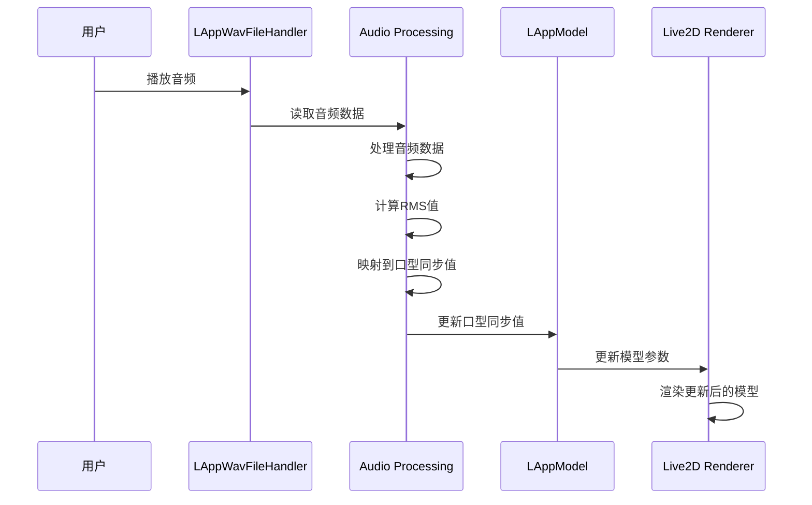
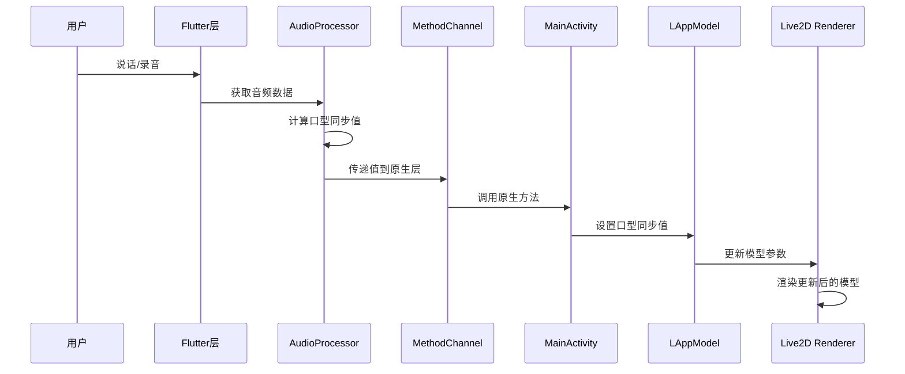
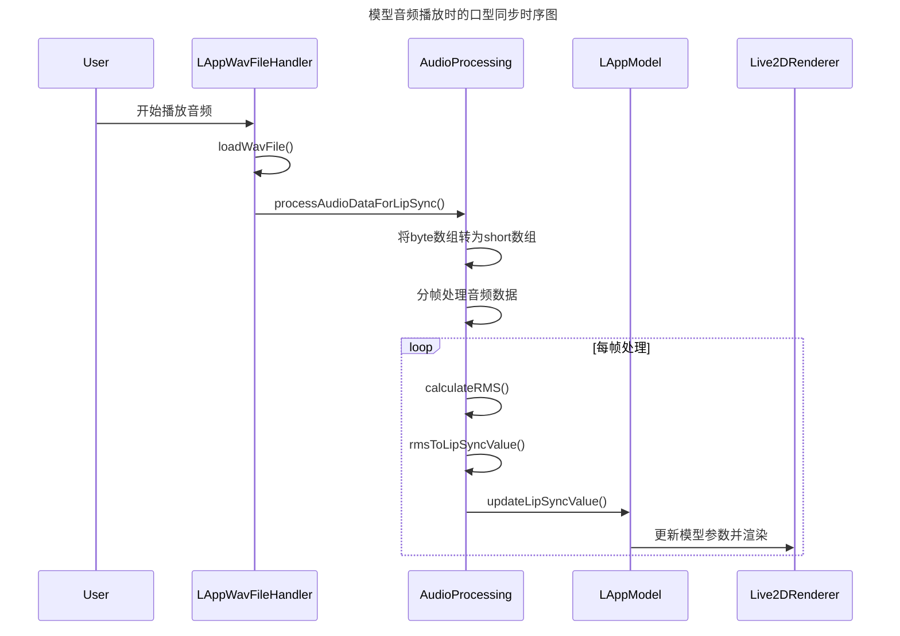
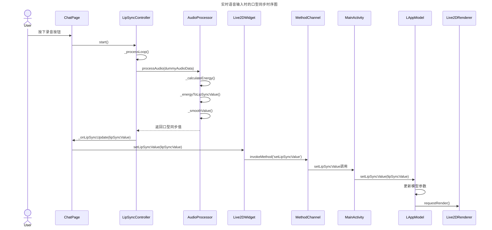

# 口型同步实现原理

## 1. 概述

口型同步（Lip Sync）是指在播放音频或说话时，让虚拟角色的嘴部动作与音频内容同步，从而提升用户体验的真实感。在本项目中，我们实现了两种场景下的口型同步功能：

1. 播放模型内置音频时的口型同步（基于LAppWavFileHandler）
2. 实时语音输入时的口型同步（基于外部音频输入）

## 2. 实现原理

### 2.1 核心思想

口型同步的核心思想是将音频信号的能量特征转化为模型参数的变化。具体来说，通过对音频数据进行实时分析，计算出当前音频的能量值，并将其映射到0.0-1.0的范围内，代表嘴部的开合程度。

### 2.2 技术方案

对于两种不同的应用场景，我们采用了不同的技术实现方案：

#### 2.2.1 模型音频播放时的口型同步

1. **音频播放**：使用LAppWavFileHandler播放模型绑定的音频文件
2. **音频分析**：在播放过程中实时分析音频数据的能量特征
3. **特征提取**：计算音频的RMS（均方根）值作为能量指标
4. **数值映射**：将RMS值映射到0.0-1.0范围内的口型同步值
5. **模型驱动**：将口型同步值应用于Live2D模型的口型参数
6. **实时更新**：按照设定的帧率持续更新口型参数

#### 2.2.2 实时语音输入时的口型同步

1. **音频输入**：从麦克风等设备获取实时音频流
2. **音频处理**：在Flutter层处理音频数据并计算口型同步值
3. **跨平台通信**：通过MethodChannel将口型同步值传递到Android原生层
4. **模型驱动**：Android原生层接收值并更新Live2D模型的口型参数
5. **视图刷新**：确保每次值更新后调用渲染刷新方法

## 3. 实现方法

### 3.1 音频播放时的口型同步（LAppWavFileHandler）

在LAppWavFileHandler类中，我们增加了音频分析和口型同步功能：

1. **音频数据处理**：
   ```java
   private void processAudioDataForLipSync(byte[] audioData, int sampleRate, int channelCount) {
       // 将byte数组转换为short数组（16位音频数据）
       short[] samples = new short[(audioData.length - 100) / 2];
       ByteBuffer.wrap(audioData, 100, audioData.length - 100)
                .order(ByteOrder.LITTLE_ENDIAN)
                .asShortBuffer()
                .get(samples);
       
       // 计算RMS值用于口型同步
       int framesPerSecond = 60; // 每秒更新60次口型
       int samplesPerFrame = sampleRate / framesPerSecond;
       
       for (int i = 0; i < samples.length; i += samplesPerFrame) {
           int endIndex = Math.min(i + samplesPerFrame, samples.length);
           double rms = calculateRMS(samples, i, endIndex);
           
           // 将RMS值转换为口型同步值(0.0-1.0)
           double lipSyncValue = rmsToLipSyncValue(rms);
           
           // 更新口型同步上下文
           lipSyncContext.updateLipSyncValue((float) lipSyncValue);
           
           try {
               // 控制更新频率
               Thread.sleep(1000 / framesPerSecond);
           } catch (InterruptedException e) {
               Thread.currentThread().interrupt();
               break;
           }
       }
   }
   ```

2. **RMS计算**：
   ```java
   private double calculateRMS(short[] samples, int start, int end) {
       double sum = 0.0;
       for (int i = start; i < end; i++) {
           double sample = samples[i] / 32768.0; // 转换为-1.0到1.0范围
           sum += sample * sample;
       }
       return Math.sqrt(sum / (end - start));
   }
   ```

3. **RMS到口型值映射**：
   ```java
   private double rmsToLipSyncValue(double rms) {
       // 应用对数缩放使低音量更敏感
       double threshold = 0.01; // 静音阈值
       if (rms < threshold) {
           return 0.0;
       }
       
       // 对数缩放
       double logRms = Math.log10(rms + 1);
       // 限制在0.0-1.0范围内
       return Math.min(1.0, Math.max(0.0, logRms * 2));
   }
   ```

### 3.2 实时语音输入时的口型同步

#### 3.2.1 Android端实现

在Android端，我们在LAppModel类中添加了以下方法：

1. **设置口型同步值**：
   ```java
   public void setLipSyncValue(float value) {
       lipSyncValue = value;
       
       if (lipSync) {
           for (int i = 0; i < lipSyncIds.size(); i++) {
               CubismId lipSyncId = lipSyncIds.get(i);
               model.addParameterValue(lipSyncId, value, 0.8f);
           }
       }
   }
   ```

2. **启用/禁用口型同步**：
   ```java
   public void enableLipSync(boolean enable) {
       lipSync = enable;
   }
   ```

#### 3.2.2 Flutter端实现

在Flutter端，我们使用AudioProcessor处理音频数据：

1. **音频处理器（AudioProcessor）**：
   AudioProcessor类负责处理音频数据并计算口型同步值：
   
   - 能量计算：
     ```dart
     double _calculateEnergy(List<double> audioData) {
       double sum = 0.0;
       for (double sample in audioData) {
         sum += sample * sample;
       }
       return sqrt(sum / audioData.length);
     }
     ```
   
   - 能量到口型值映射：
     ```dart
     double _energyToLipSyncValue(double energy) {
       if (energy < _energyThreshold) {
         return 0.0;
       }
       
       double normalizedEnergy = min(1.0, energy / 0.5);
       double logEnergy = log(normalizedEnergy + 1) / log(2);
       return min(1.0, max(0.0, logEnergy));
     }
     ```
   
   - 平滑处理：
     ```dart
     double _smoothValue(double currentValue) {
       double smoothedValue = _lastLipSyncValue +
           _smoothingFactor * (currentValue - _lastLipSyncValue);
       _lastLipSyncValue = smoothedValue;
       return smoothedValue;
     }
     ```

2. **口型同步控制器（LipSyncController）**：
   LipSyncController类负责控制口型同步的整体流程：
   
   - 启动/停止控制
   - 定期处理音频数据
   - 回调通知

3. **Flutter Widget集成**：
   在Live2DWidget中添加口型同步值设置方法：
   ```dart
   Future<void> _setLipSyncValue(double value) async {
     try {
       await _channel.invokeMethod('setLipSyncValue', {
         'value': value,
         'instanceId': _actualInstanceId,
       });
     } catch (e) {
       // 错误处理
     }
   }
   ```

## 4. 工作流程

### 4.1 模型音频播放时的口型同步流程



### 4.2 实时语音输入时的口型同步流程



## 5. 时序图

### 5.1 模型音频播放时的口型同步时序图



### 5.2 实时语音输入时的口型同步时序图



## 6. 关键参数说明

| 参数 | 默认值 | 说明 |
|------|--------|------|
| energyThreshold | 0.01 | 音频能量阈值，低于此值认为是静音 |
| smoothingFactor | 0.3 | 平滑因子，用于平滑口型同步值的变化 |
| sampleRate | 16000 | 音频采样率 |
| updateInterval | 50ms | 口型同步更新间隔 |
| framesPerSecond | 60 | 模型音频播放时的口型同步更新帧率 |

## 7. 性能优化

1. **平滑处理**：通过平滑因子避免口型变化过于剧烈
2. **阈值判断**：低于能量阈值时直接返回0，避免无效计算
3. **定期更新**：控制更新频率以平衡流畅度和性能消耗
4. **值范围限制**：确保口型同步值始终在0.0-1.0范围内
5. **异步处理**：音频播放和处理在独立线程中进行，不影响主线程

## 8. 扩展性考虑

1. **多种音频特征支持**：可以扩展支持更多音频特征，如频率分析
2. **多模型支持**：可以针对不同模型设置不同的口型参数映射
3. **真实音频输入**：当前使用模拟数据，后续可以接入真实音频输入源
4. **个性化调节**：可以提供参数调节界面，让用户自定义口型同步效果
5. **混合模式支持**：可以同时支持模型音频播放和实时语音输入的口型同步