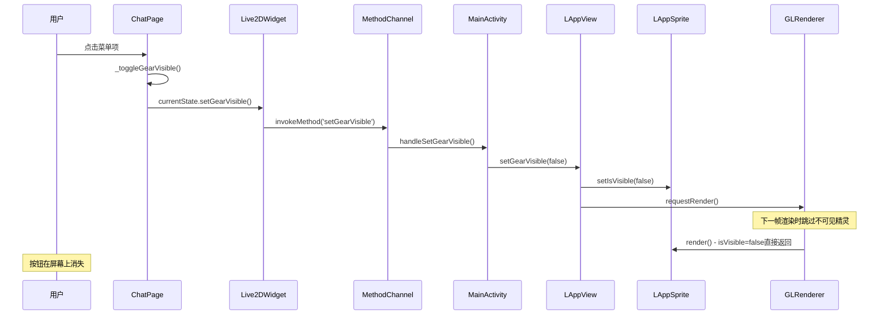
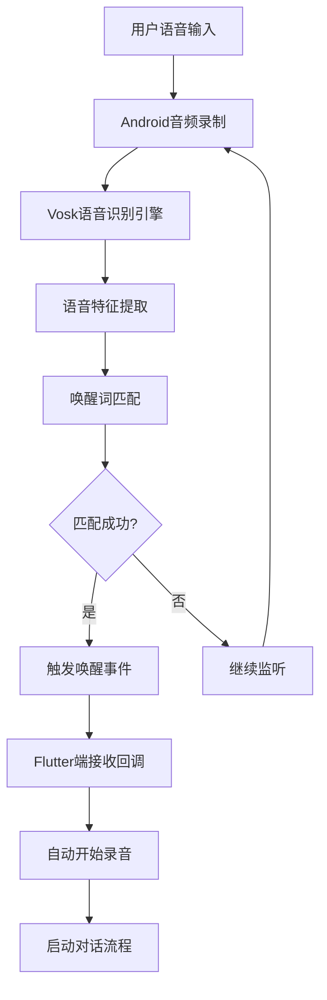
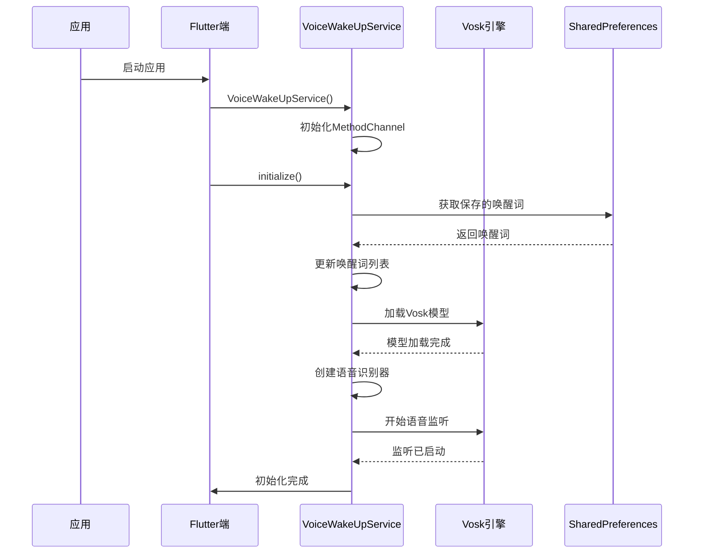
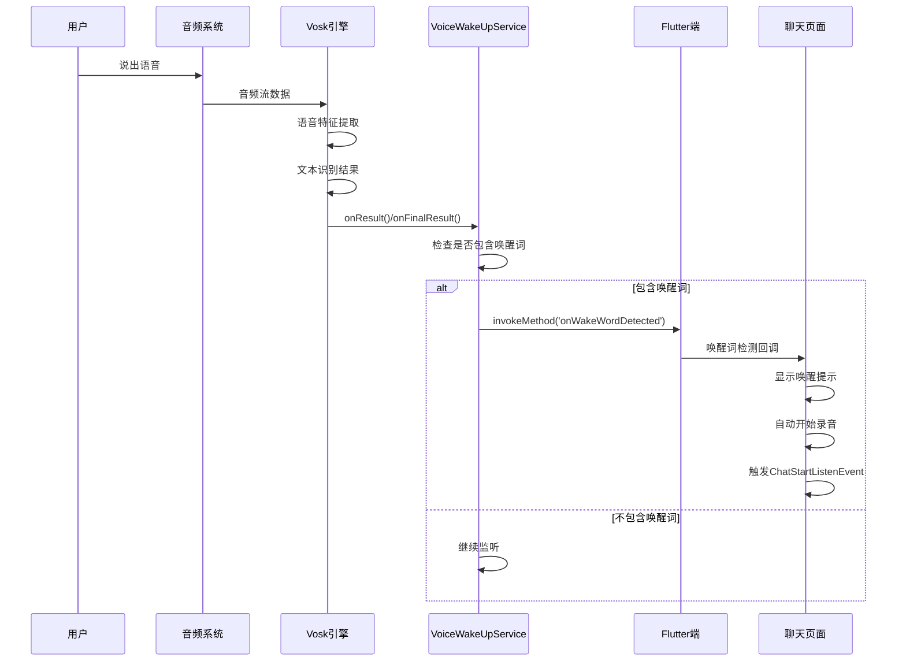
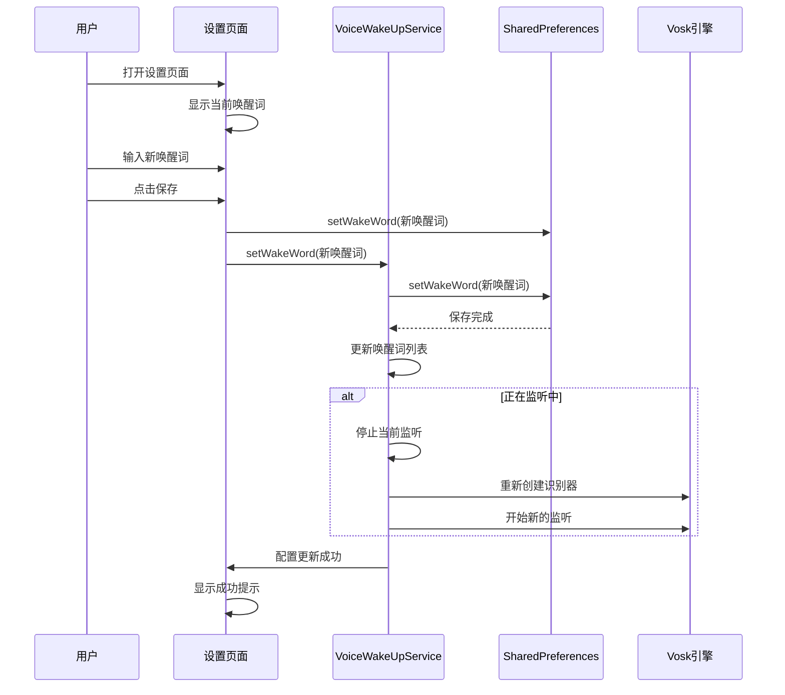

# 小智Android项目知识库

## 项目概述

这是一个基于Flutter的Android应用，集成了Live2D角色显示功能，主要包含聊天、设置、通话等核心功能。项目采用Flutter + Android原生混合开发模式，通过MethodChannel和PlatformView实现Flutter与Android Live2D模块的交互。

## 项目架构

### 整体架构
```
xiaozhi-android/
├── lib/                          # Flutter应用层
│   ├── main.dart                 # 应用入口
│   ├── page/                     # 页面层
│   │   ├── chat_page.dart        # 聊天页面
│   │   ├── call_page.dart        # 通话页面
│   │   ├── setting_page.dart     # 设置页面
│   │   └── live2d_test_page.dart # Live2D测试页面
│   ├── widget/                   # Flutter组件层
│   │   ├── live2d_widget.dart   # Live2D组件
│   │   ├── fade_text_widget.dart # 渐隐文本组件
│   │   └── hold_to_talk_widget.dart # 按住说话组件
│   ├── bloc/                     # 状态管理层
│   │   ├── chat/                 # 聊天状态管理
│   │   │   ├── chat_bloc.dart    # 聊天业务逻辑
│   │   │   ├── chat_event.dart   # 聊天事件定义
│   │   │   └── chat_state.dart   # 聊天状态定义
│   │   └── ota/                 # OTA更新状态管理
│   │       ├── ota_bloc.dart     # OTA业务逻辑
│   │       ├── ota_event.dart    # OTA事件定义
│   │       └── ota_state.dart    # OTA状态定义
│   ├── model/                    # 数据模型层
│   │   ├── storage_message.dart  # 存储消息模型
│   │   └── websocket_message.dart # WebSocket消息模型
│   ├── util/                     # 工具层
│   │   ├── common_utils.dart     # 通用工具
│   │   ├── shared_preferences_util.dart # SharedPreferences工具
│   │   └── storage_util.dart     # 存储工具
│   ├── common/                   # 常量层
│   │   └── x_const.dart         # 应用常量
│   └── l10n/                    # 国际化
│       ├── app_en.arb            # 英文资源
│       └── app_zh.arb            # 中文资源
├── android/                      # Android原生层
│   ├── app/                      # 应用模块
│   │   ├── build.gradle.kts       # 应用构建配置
│   │   ├── proguard-rules.pro     # 混淆规则
│   │   ├── src/main/             # 主要源码
│   │   │   ├── AndroidManifest.xml # 应用清单
│   │   │   ├── java/             # Java源码
│   │   │   │   ├── io/flutter/app/     # 实际使用的主Activity包
│   │   │   │   │   └── MainActivity.java # Flutter主Activity（实际使用）
│   │   │   │   ├── com/thinkerror/xiaozhi/ # 备用应用主包
│   │   │   │   │   ├── MainActivity.java # 备用MainActivity
│   │   │   │   │   └── BootReceiver.java  # 开机自启动接收器
│   │   │   │   └── com/live2d/      # Live2D模块
│   │   │   │       ├── LAppDelegate.java # Live2D应用委托
│   │   │   │       ├── LAppLive2DManager.java # Live2D模型管理器
│   │   │   │       ├── LAppModel.java  # Live2D模型类
│   │   │   │       ├── LAppView.java   # Live2D视图类
│   │   │   │       ├── GLRenderer.java # OpenGL渲染器
│   │   │   │       ├── Live2DPlatformView.java # Flutter PlatformView
│   │   │   │       ├── Live2DViewFactory.java  # PlatformView工厂
│   │   │   │       ├── LAppTextureManager.java # 纹理管理器
│   │   │   │       ├── LAppSprite.java # 精灵类
│   │   │   │       ├── LAppSpriteShader.java # 精灵着色器
│   │   │   │       ├── LAppPal.java   # 平台工具类
│   │   │   │       ├── LAppDefine.java # 常量定义
│   │   │   │       ├── LAppWavFileHandler.java # 音频处理器
│   │   │   │       ├── TouchManager.java # 触摸管理器
│   │   │   │       └── TestLive2DActivity.java # Live2D测试Activity
│   │   │   └── res/               # Android资源
│   │   │       ├── drawable/       # 可绘制资源
│   │   │       ├── mipmap-*/       # 应用图标
│   │   │       └── values/         # 值资源
│   │   └── src/debug/             # 调试配置
│   │       └── AndroidManifest.xml
│   │   └── src/profile/           # 发布配置
│   │       └── AndroidManifest.xml
│   ├── build.gradle.kts           # 项目构建配置
│   ├── gradle.properties          # Gradle属性
│   ├── settings.gradle.kts         # 项目设置
│   ├── gradle/                    # Gradle包装器
│   │   └── wrapper/               # Gradle包装器文件
│   │       ├── gradle-wrapper.jar
│   │       └── gradle-wrapper.properties
│   └── libs/                      # 本地库
│       └── live2d/                # Live2D SDK
│           ├── framework-release.aar # Live2D框架
│           ├── Live2DCubismCore.aar  # Live2D核心
│           └── Framework/           # Live2D框架源码
│               ├── build.gradle
│               ├── settings.gradle
│               └── framework/       # 框架Java源码
├── assets/                       # 资源文件
│   ├── icon.png                   # 应用图标
│   └── live2d/                   # Live2D模型资源
│       ├── back_class_normal.png   # 背景图片
│       ├── close.png              # 关闭按钮
│       ├── icon_gear.png         # 齿轮图标
│       ├── Haru/                 # Haru模型
│       ├── Hiyori/               # Hiyori模型
│       ├── Mao/                  # Mao模型
│       ├── Mark/                 # Mark模型
│       ├── Natori/               # Natori模型
│       ├── Rice/                 # Rice模型
│       ├── Wanko/                 # Wanko模型
│       └── Shaders/              # 着色器文件
│           ├── FragSprite.frag    # 片段着色器
│           └── VertSprite.vert    # 顶点着色器
├── docs/                         # 文档
│   ├── architecture_design.md    # 架构设计文档
│   ├── build_guide.md           # 构建指南
│   └── image/                   # 文档图片
├── ios/                         # iOS项目（Flutter生成）
├── Live2DCubismSdkForJava-5-r.4.1/ # Live2D SDK完整源码
│   ├── Core/                     # Live2D核心
│   ├── Framework/                # Live2D框架
│   ├── Sample/                   # 示例代码
│   └── build.gradle              # SDK构建配置
├── .gitignore                   # Git忽略文件
├── .metadata                    # Flutter元数据
├── analysis_options.yaml         # Dart分析配置
├── devtools_options.yaml        # DevTools配置
├── l10n.yaml                   # 国际化配置
└── LICENSE                     # 许可证
```

## 核心模块分析

### 1. Flutter应用层

#### 1.1 页面层 (lib/page/)

##### chat_page.dart

聊天页面，包含Live2D角色显示和聊天功能

###### 页面布局结构

页面整体采用Stack布局，分为主要内容区域和覆盖层：

```
+-----------------------------------------------------+
| AppBar (顶部导航栏)                                 |
|  - 标题: 小智                                       |
|  - 设置按钮 | 可见性控制菜单 | 通话按钮              |
+-----------------------------------------------------+
|                                                     |
|  Stack (主内容区域)                                 |
|  +-------------------------------------------------+ |
|  |  Column (主要内容列)                            | |
|  |  +---------------------------------------------+ | |
|  |  |  Expanded (消息列表区域)                    | | |
|  |  |  +-----------------------------------------+ | | |
|  |  |  |  Stack (消息列表堆叠布局)               | | | |
|  |  |  |  +-------------------------------------+ | | | |
|  |  |  |  |  Live2DWidget (背景层)              | | | | |
|  |  |  |  |  - 铺满整个可用区域                 | | | | |
|  |  |  |  |  - 显示Live2D模型                   | | | | |
|  |  |  |  +-------------------------------------+ | | | |
|  |  |  |  +-------------------------------------+ | | | |
|  |  |  |  |  Positioned (消息列表层)            | | | | |
|  |  |  |  |  - top: 80px (为顶部按钮留空间)     | | | | |
|  |  |  |  |  - right: 80px (为右侧按钮留空间)   | | | | |
|  |  |  |  |  - SmartRefresher (下拉刷新容器)    | | | | |
|  |  |  |  |    - ListView (消息列表)           | | | | |
|  |  |  |  +-------------------------------------+ | | | |
|  |  |  |  +-------------------------------------+ | | | |
|  |  |  |  |  HoldToTalkWidget (覆盖层)          | | | | |
|  |  |  |  |  - 条件性显示(仅在说话时)           | | | | |
|  |  |  |  +-------------------------------------+ | | | |
|  |  |  +-----------------------------------------+ | | |
|  |  |  +-----------------------------------------+ | | |
|  |  |  |  Padding (底部按住说话按钮区域)         | | | |
|  |  |  |    - GestureDetector (手势检测)         | | | |
|  |  |  |      - FilledButton (按住说话按钮)      | | | |
|  |  |  +-----------------------------------------+ | | |
|  |  +---------------------------------------------+ | |
|  +-------------------------------------------------+ |
+-----------------------------------------------------+
```

###### 布局特点

1. **层级结构**：
   - 最底层：Live2DWidget作为整个消息区域的背景，铺满整个可用空间
   - 中间层：SmartRefresher承载消息列表，但为Live2D的按钮区域留出空间
   - 最顶层：HoldToTalkWidget条件性显示（只有在说话时才显示）

2. **触摸事件处理**：
   - Live2DWidget位于背景层，可以接收完整的触摸事件
   - SmartRefresher通过Positioned定位，并特意避开Live2D按钮区域（顶部80px，右侧80px）
   - HoldToTalkWidget使用条件渲染，仅在说话时显示，避免干扰其他组件

3. **关键设计决策**：
   - Live2DWidget使用Positioned.fill铺满整个区域，确保模型显示效果最佳
   - SmartRefresher通过调整位置和尺寸为Live2D按钮留出空间，既不影响模型交互，也不影响消息列表功能
   - HoldToTalkWidget采用条件渲染策略，在不使用时完全消失，避免遮挡其他组件

###### 触摸事件优化历史

1. 初始版本中，由于布局结构问题，Live2DWidget无法接收触摸事件
2. 经过多次调试发现，主要是因为：
   - 全屏GestureDetector拦截了所有触摸事件
   - HoldToTalkWidget覆盖层影响了事件传递
   - SmartRefresher占据了整个区域，遮挡了Live2D按钮
3. 最终解决方案：
   - 限制GestureDetector作用范围，仅包裹按住说话按钮
   - 使用条件渲染HoldToTalkWidget，仅在说话时显示
   - 调整SmartRefresher的位置和尺寸，为Live2D按钮留出空间

###### 齿轮和电源按钮可见性控制调试

为了调试齿轮和电源按钮的显示/隐藏功能，增加了详细的日志输出：

1. 在PopupMenuButton的onSelected回调中添加了菜单项选择的日志
2. 在_toggleGearVisible和_togglePowerVisible函数中增强了日志输出
3. 添加了对Live2D widget是否存在以及方法调用完成后的日志跟踪

这些调试日志可以帮助追踪按钮可见性控制功能的执行流程，更容易发现潜在问题。

#### live2d_test_page.dart
#### 1.2 组件层 (lib/widget/)
- **live2d_widget.dart**: Live2D组件，核心的Flutter-Android交互组件
- **fade_text_widget.dart**: 渐隐文本组件
- **hold_to_talk_widget.dart**: 按住说话组件

#### 1.3 状态管理层 (lib/bloc/)
- **chat/**: 聊天状态管理
  - chat_bloc.dart: 聊天业务逻辑
  - chat_event.dart: 聊天事件定义
  - chat_state.dart: 聊天状态定义
- **ota/**: OTA更新状态管理
  - ota_bloc.dart: OTA业务逻辑
  - ota_event.dart: OTA事件定义
  - ota_state.dart: OTA状态定义

### 2. Android原生层

#### 2.1 应用主模块 (io.flutter.app)
- **MainActivity.java**: 实际使用的Flutter主Activity，继承FlutterActivity，包含完整的MethodChannel处理逻辑

#### 2.1.1 备用应用模块 (com.thinkerror.xiaozhi)
- **MainActivity.java**: 备用的Flutter主Activity（可能未使用）
- **BootReceiver.java**: 开机自启动广播接收器

#### 2.2 Live2D模块 (com.live2d)

##### 核心管理类
- **LAppDelegate.java**: Live2D应用委托，单例模式管理Live2D生命周期
- **LAppLive2DManager.java**: Live2D模型管理器，负责模型加载、切换和更新
- **LAppModel.java**: Live2D模型类，继承CubismUserModel
- **LAppView.java**: Live2D视图类，负责渲染和触控处理

##### 渲染和视图类
- **GLRenderer.java**: OpenGL ES渲染器，实现GLSurfaceView.Renderer接口
- **Live2DPlatformView.java**: Flutter PlatformView实现，连接Flutter和Android Live2D
- **Live2DViewFactory.java**: PlatformView工厂类

##### 资源和工具类
- **LAppTextureManager.java**: 纹理管理器，负责加载和管理OpenGL纹理
- **LAppSprite.java**: 精灵类，用于绘制背景和UI元素
- **LAppSpriteShader.java**: 精灵着色器管理
- **TouchManager.java**: 触摸事件管理器
- **LAppPal.java**: 平台相关工具类
- **LAppDefine.java**: 常量定义类
- **LAppWavFileHandler.java**: 音频文件处理器

##### 测试类
- **TestLive2DActivity.java**: Live2D测试Activity

## 模块间依赖关系

### 1. Flutter -> Android 交互
```
Flutter (live2d_widget.dart)
    ↓ MethodChannel ('live2d_channel')
Android (Live2DPlatformView.java)
    ↓ PlatformView ('live2d_view')
Live2D Native Module
```

### 2. Live2D模块内部依赖
```
LAppDelegate (核心委托)
    ├── LAppLive2DManager (模型管理)
    │   └── LAppModel (单个模型)
    ├── LAppView (视图管理)
    │   ├── LAppSprite (精灵绘制)
    │   └── TouchManager (触摸管理)
    ├── LAppTextureManager (纹理管理)
    └── GLRenderer (渲染管理)
```

## 详细函数级别调用时序

### 1. 应用启动时序


### 2. Live2D模型加载详细流程

```mermaid
sequenceDiagram
    participant Manager as LAppLive2DManager
    delegate Assets as AssetManager
    participant Model as LAppModel
    delegate Pal as LAppPal
    delegate Framework as CubismFramework
    delegate Renderer as CubismRenderer
    delegate TextureMgr as LAppTextureManager

    Manager->>Manager: setUpModel()
    Manager->>Assets: assets.list("flutter_assets/assets/live2d/")
    loop 遍历每个目录
        Manager->>Assets: assets.list(modelDirPath)
        Manager->>Manager: 检查.model3.json文件
        Manager->>Manager: modelDir.add(dirName)
    end
    Manager->>Manager: changeScene(index)
    Manager->>Manager: releaseAllModel()
    Manager->>Model: new LAppModel()
    Model->>Model: loadAssets(modelPath, modelJsonName)
    Model->>Pal: createBuffer(modelJsonName)
    Pal->>Assets: assets.open(filePath)
    Assets-->>Pal: InputStream
    Pal->>Pal: 读取文件到byte[]
    Model->>Model: new CubismModelSettingJson(buffer)
    Model->>Model: setupModel(setting)
    Model->>Pal: createBuffer(moc3FileName)
    Model->>Model: loadModel(buffer, mocConsistency)
    Model->>Framework: CubismRendererAndroid.create()
    Model->>Model: setupRenderer(renderer)
    loop 加载纹理
        Model->>TextureMgr: createTextureFromPngFile(texturePath)
        TextureMgr->>TextureMgr: 检查纹理缓存
        alt 纹理未缓存
            TextureMgr->>Assets: assets.open(texturePath)
            TextureMgr->>TextureMgr: BitmapFactory.decodeStream()
            TextureMgr->>TextureMgr: GLES20.glGenTextures()
            TextureMgr->>TextureMgr: GLUtils.texImage2D()
            TextureMgr->>TextureMgr: 缓存纹理信息
        end
        Model->>Renderer: bindTexture(index, glTextureId)
    end
    Model->>Model: setupModel() - 加载表达式
    loop 加载表情文件
        Model->>Pal: createBuffer(expressionPath)
        Model->>Model: loadExpression(buffer)
    end
    Model->>Model: setupModel() - 加载物理
    Model->>Pal: createBuffer(physicsPath)
    Model->>Model: loadPhysics(buffer)
    Model->>Model: setupModel() - 加载姿态
    Model->>Pal: createBuffer(posePath)
    Model->>Model: loadPose(buffer)
    Model->>Model: setupModel() - 加载动作组
    loop 加载所有动作组
        Model->>Pal: preLoadMotionGroup(groupName)
        loop 加载组内动作
            Model->>Pal: createBuffer(motionPath)
            Model->>Model: loadMotion(buffer)
            Model->>Model: motions.put(motionName, motion)
        end
    end
    Model->>Model: model.saveParameters()
```

### 3. 触摸事件处理详细流程


### 4. 渲染循环详细流程


## 详细数据流分析

### 1. 模型数据流


### 2. 触摸数据流


### 3. 渲染数据流


### 4. 内存管理流程


### 5. 错误处理流程

```mermaid
flowchart TD
    A[函数调用] --> B{try-catch检查}
    B -->|正常执行| C[返回结果]
    B -->|异常发生| D[捕获异常类型]
    
    D --> E{异常类型判断}
    E -->|IOException| F[文件访问错误]
    E -->|OpenGLException| G[渲染错误]
    E -->|NullPointerException| H[空指针错误]
    E -->|其他异常| I[未知错误]
    
    F --> J[检查文件路径]
    J --> K[检查assets目录]
    K --> L[记录错误日志]
    L --> M[返回默认值]
    
    G --> N[检查GL状态]
    N --> O[检查着色器编译]
    O --> P[检查纹理绑定]
    P --> Q[记录GL错误码]
    Q --> R[降级处理]
    
    H --> S[检查对象初始化]
    S --> T[检查依赖注入]
    T --> U[记录空堆栈]
    U --> V[安全返回]
    
    I --> W[记录异常堆栈]
    W --> X[发送错误报告]
    X --> Y[用户友好提示]
    
    M --> Z[错误恢复]
    R --> Z
    V --> Z
    Y --> Z
    Z --> AA[继续执行]

## 配置文件说明

### 1. Android配置
- **android/app/build.gradle.kts**: 应用构建配置，包含Live2D依赖
- **android/settings.gradle.kts**: 项目设置，包含Live2D框架模块
- **android/app/src/main/AndroidManifest.xml**: 应用清单，包含权限和Activity配置

### 2. Live2D配置
- **LAppDefine.java**: Live2D相关常量定义
  - 资源路径: `flutter_assets/assets/live2d/`
  - 缩放比例、逻辑视图范围等
  - 调试开关、渲染目标配置等

### 3. 模型配置
每个Live2D模型包含:
- **.model3.json**: 模型主配置文件
- **.moc3**: 模型数据文件
- **.physics3.json**: 物理参数配置
- **.pose3.json**: 姿态配置
- **.exp3.json**: 表情动作文件
- **.motion3.json**: 动作文件
- **.png**: 纹理贴图文件

## 技术特点

### 1. 架构优势
- **模块化设计**: Live2D功能完全解耦，可独立使用
- **单例管理**: LAppDelegate采用单例模式，统一管理Live2D生命周期
- **资源缓存**: LAppTextureManager实现纹理缓存，提高性能
- **实例管理**: 支持多个Live2D实例，通过instanceId区分

### 2. 性能优化
- **OpenGL ES 2.0**: 使用硬件加速渲染
- **连续渲染模式**: RENDERMODE_CONTINUOUSLY确保流畅动画
- **纹理缓存机制**: 避免重复加载相同纹理
- **异步音频播放**: 动作声音异步播放不阻塞主线程

### 3. 交互设计
- **MethodChannel通信**: Flutter与Android原生层高效通信
- **PlatformView嵌入**: 原生Live2D视图无缝嵌入Flutter
- **触摸事件传递**: 完整的触摸事件从Flutter传递到Live2D模型
- **参数映射**: 屏幕坐标正确映射到模型参数

## 扩展点

### 1. 新增Live2D模型
1. 将模型文件夹放入 `assets/live2d/` 目录
2. 确保包含 `.model3.json` 和同名文件夹结构
3. 应用启动时会自动扫描和加载

### 2. 自定义交互
1. 在 `Live2DWidget` 中添加新的MethodChannel方法
2. 在 `Live2DPlatformView` 中实现对应处理逻辑
3. 通过 `LAppDelegate` 调用相关Live2D功能

### 3. 性能调优
1. 调整 `LAppDefine` 中的渲染参数
2. 优化模型资源大小和分辨率
3. 调整OpenGL渲染状态设置

## 调试和测试

### 1. 调试开关
- `LAppDefine.DEBUG_LOG_ENABLE`: 启用详细日志
- `LAppDefine.DEBUG_TOUCH_LOG_ENABLE`: 启用触摸日志
- Flutter端: `kDebugMode` 检查

### 2. 测试工具
- **TestLive2DActivity**: 独立的Live2D测试Activity
- **live2d_test_page.dart**: Flutter端Live2D测试页面
- 详细的日志输出机制

### 3. 常见问题排查
1. 模型不显示: 检查assets目录和文件路径
2. 触摸无响应: 检查坐标转换和碰撞检测
3. 性能问题: 检查渲染频率和资源大小
4. 内存泄漏: 检查生命周期管理和资源释放

## 实际MainActivity.java详细分析

### 1. MainActivity (io.flutter.app) 类

这是项目实际使用的主Activity，继承自FlutterActivity，负责Flutter引擎与Live2D模块的桥接。

#### 核心配置函数
```java
// Flutter引擎配置 - 应用启动时自动调用
@Override
public void configureFlutterEngine(@NonNull FlutterEngine flutterEngine) {
    Log.d(TAG, "configureFlutterEngine: Starting configuration");
    
    // 1. 注册PlatformView工厂 - 创建Live2D原生视图
    live2DViewFactory = new Live2DViewFactory(this);
    flutterEngine
            .getPlatformViewsController()
            .getRegistry()
            .registerViewFactory("live2d_view", live2DViewFactory);
    
    // 2. 调用父类方法 - 完成Flutter基础配置
    super.configureFlutterEngine(flutterEngine);
    
    // 3. 注册MethodChannel - 处理Flutter到Android的方法调用
    setupMethodChannel(flutterEngine);
}
```

#### MethodChannel方法处理
```java
private void setupMethodChannel(FlutterEngine flutterEngine) {
    new MethodChannel(flutterEngine.getDartExecutor().getBinaryMessenger(), CHANNEL)
            .setMethodCallHandler((call, result) -> {
                Log.d(TAG, "MethodChannel call received: " + call.method);
                
                switch (call.method) {
                    case "initLive2D":
                        handleInitLive2D(call, result);
                        break;
                    case "onTap":
                        handleOnTap(call, result);
                        break;
                    case "triggerExpression":
                        handleTriggerExpression(call, result);
                        break;
                    case "playMotion":
                        handlePlayMotion(call, result);
                        break;
                    case "setGearVisible":
                        handleSetGearVisible(call, result);
                        break;
                    case "setPowerVisible":
                        handleSetPowerVisible(call, result);
                        break;
                    case "isGearVisible":
                        handleIsGearVisible(call, result);
                        break;
                    case "isPowerVisible":
                        handleIsPowerVisible(call, result);
                        break;
                    case "refreshView":
                        handleRefreshView(call, result);
                        break;
                    default:
                        Log.w(TAG, "Unknown method called: " + call.method);
                        result.notImplemented();
                        break;
                }
            });
}
```

#### 具体方法处理实现

##### 1. 初始化Live2D
```java
private void handleInitLive2D(MethodCall call, MethodChannel.Result result) {
    String modelPath = call.argument("modelPath");
    String instanceId = call.argument("instanceId");
    Log.d(TAG, "initLive2D called: modelPath=" + modelPath + ", instanceId=" + instanceId);
    
    // TODO: 实现初始化Live2D模型的逻辑
    // 这里可以添加模型初始化代码
    result.success(null);
}
```

##### 2. 触摸事件处理
```java
private void handleOnTap(MethodCall call, MethodChannel.Result result) {
    Double x = call.argument("x");
    Double y = call.argument("y");
    String instanceId = call.argument("instanceId");
    Log.d(TAG, "onTap called: x=" + x + ", y=" + y + ", instanceId=" + instanceId);
    
    // TODO: 实现点击事件处理逻辑
    // 这里可以添加触摸事件转发代码
    result.success(null);
}
```

##### 3. 触发表情
```java
private void handleTriggerExpression(MethodCall call, MethodChannel.Result result) {
    String expressionName = call.argument("expressionName");
    String instanceId = call.argument("instanceId");
    Log.d(TAG, "triggerExpression called: expressionName=" + expressionName + ", instanceId=" + instanceId);
    
    try {
        // 获取当前模型并触发表情
        LAppLive2DManager live2DManager = LAppLive2DManager.getInstance();
        if (live2DManager.getModel(0) != null) {
            live2DManager.getModel(0).setRandomExpression();
            result.success(null);
        } else {
            result.error("MODEL_NOT_READY", "Live2D model is not ready", null);
        }
    } catch (Exception e) {
        Log.e(TAG, "Error in triggerExpression", e);
        result.error("EXPRESSION_ERROR", "Failed to trigger expression: " + e.getMessage(), null);
    }
}
```

##### 4. 播放动作
```java
private void handlePlayMotion(MethodCall call, MethodChannel.Result result) {
    String motionGroup = call.argument("motionGroup");
    Integer priority = call.argument("priority");
    String instanceId = call.argument("instanceId");
    Log.d(TAG, "playMotion called: motionGroup=" + motionGroup + ", priority=" + priority + ", instanceId=" + instanceId);
    
    if (motionGroup == null) {
        result.error("INVALID_ARGUMENT", "Motion group is null", null);
        return;
    }
    
    try {
        // 获取当前模型并播放动作
        LAppLive2DManager live2DManager = LAppLive2DManager.getInstance();
        if (live2DManager.getModel(0) != null) {
            int prio = priority != null ? priority : Priority.NORMAL.getPriority();
            live2DManager.getModel(0).startRandomMotion(motionGroup, prio);
            result.success(null);
        } else {
            result.error("MODEL_NOT_READY", "Live2D model is not ready", null);
        }
    } catch (Exception e) {
        Log.e(TAG, "Error in playMotion", e);
        result.error("MOTION_ERROR", "Failed to play motion: " + e.getMessage(), null);
    }
}
```

##### 5. UI元素可见性控制
```java
private void handleSetGearVisible(MethodCall call, MethodChannel.Result result) {
    Boolean visible = call.argument("visible");
    String instanceId = call.argument("instanceId");
    Log.d(TAG, "setGearVisible called: visible=" + visible + ", instanceId=" + instanceId);
    
    if (visible == null) {
        result.error("INVALID_ARGUMENT", "Visible argument is null", null);
        return;
    }
    
    try {
        LAppDelegate appDelegate = LAppDelegate.getInstance();
        if (appDelegate == null) {
            result.error("APP_DELEGATE_NOT_READY", "Live2D app delegate is not ready", null);
            return;
        }
        
        LAppView appView = appDelegate.getView();
        if (appView == null) {
            result.error("VIEW_NOT_READY", "Live2D view is not ready", null);
            return;
        }
        
        // 设置齿轮按钮可见性
        appView.setGearVisible(visible);
        Log.d(TAG, "setGearVisible: Called appView.setGearVisible(" + visible + ")");
        
        // 强制刷新视图
        appDelegate.requestRender();
        Log.d(TAG, "setGearVisible: Called appDelegate.requestRender()");
        
        result.success(null);
    } catch (Exception e) {
        Log.e(TAG, "Error in setGearVisible", e);
        result.error("GEAR_VISIBLE_ERROR", "Failed to set gear visibility: " + e.getMessage(), null);
    }
}

private void handleSetPowerVisible(MethodCall call, MethodChannel.Result result) {
    Boolean visible = call.argument("visible");
    String instanceId = call.argument("instanceId");
    Log.d(TAG, "setPowerVisible called: visible=" + visible + ", instanceId=" + instanceId);
    
    if (visible == null) {
        result.error("INVALID_ARGUMENT", "Visible argument is null", null);
        return;
    }
    
    try {
        LAppDelegate appDelegate = LAppDelegate.getInstance();
        if (appDelegate == null) {
            result.error("APP_DELEGATE_NOT_READY", "Live2D app delegate is not ready", null);
            return;
        }
        
        LAppView appView = appDelegate.getView();
        if (appView == null) {
            result.error("VIEW_NOT_READY", "Live2D view is not ready", null);
            return;
        }
        
        // 设置电源按钮可见性
        appView.setPowerVisible(visible);
        Log.d(TAG, "setPowerVisible: Called appView.setPowerVisible(" + visible + ")");
        
        // 强制刷新视图
        appDelegate.requestRender();
        Log.d(TAG, "setPowerVisible: Called appDelegate.requestRender()");
        
        result.success(null);
    } catch (Exception e) {
        Log.e(TAG, "Error in setPowerVisible", e);
        result.error("POWER_VISIBLE_ERROR", "Failed to set power visibility: " + e.getMessage(), null);
    }
}
```

##### 6. 查询UI元素状态
```java
private void handleIsGearVisible(MethodCall call, MethodChannel.Result result) {
    String instanceId = call.argument("instanceId");
    Log.d(TAG, "isGearVisible called: instanceId=" + instanceId);
    
    try {
        LAppDelegate appDelegate = LAppDelegate.getInstance();
        if (appDelegate == null) {
            result.error("APP_DELEGATE_NOT_READY", "Live2D app delegate is not ready", null);
            return;
        }
        
        LAppView appView = appDelegate.getView();
        if (appView == null) {
            result.error("VIEW_NOT_READY", "Live2D view is not ready", null);
            return;
        }
        
        boolean visible = appView.isGearVisible();
        Log.d(TAG, "isGearVisible returning: " + visible);
        result.success(visible);
    } catch (Exception e) {
        Log.e(TAG, "Error in isGearVisible", e);
        result.error("GEAR_VISIBLE_QUERY_ERROR", "Failed to query gear visibility: " + e.getMessage(), null);
    }
}

private void handleIsPowerVisible(MethodCall call, MethodChannel.Result result) {
    String instanceId = call.argument("instanceId");
    Log.d(TAG, "isPowerVisible called: instanceId=" + instanceId);
    
    try {
        LAppDelegate appDelegate = LAppDelegate.getInstance();
        if (appDelegate == null) {
            result.error("APP_DELEGATE_NOT_READY", "Live2D app delegate is not ready", null);
            return;
        }
        
        LAppView appView = appDelegate.getView();
        if (appView == null) {
            result.error("VIEW_NOT_READY", "Live2D view is not ready", null);
            return;
        }
        
        boolean visible = appView.isPowerVisible();
        Log.d(TAG, "isPowerVisible returning: " + visible);
        result.success(visible);
    } catch (Exception e) {
        Log.e(TAG, "Error in isPowerVisible", e);
        result.error("POWER_VISIBLE_QUERY_ERROR", "Failed to query power visibility: " + e.getMessage(), null);
    }
}
```

##### 7. 视图刷新
```java
private void handleRefreshView(MethodCall call, MethodChannel.Result result) {
    String instanceId = call.argument("instanceId");
    Log.d(TAG, "refreshView called: instanceId=" + instanceId);
    
    try {
        LAppDelegate appDelegate = LAppDelegate.getInstance();
        if (appDelegate == null) {
            result.error("APP_DELEGATE_NOT_READY", "Live2D app delegate is not ready", null);
            return;
        }
        
        // 请求重新渲染视图
        appDelegate.requestRender();
        Log.d(TAG, "refreshView: Called appDelegate.requestRender()");
        result.success(null);
    } catch (Exception e) {
        Log.e(TAG, "Error in refreshView", e);
        result.error("REFRESH_ERROR", "Failed to refresh view: " + e.getMessage(), null);
    }
}
```

### 2. MainActivity与Flutter交互时序


### 3. 错误处理机制

MainActivity实现了完善的错误处理机制：

#### 错误类型分类
1. **参数错误**：`INVALID_ARGUMENT` - 传入参数为null或无效
2. **状态错误**：`MODEL_NOT_READY` - Live2D模型未就绪
3. **组件错误**：`VIEW_NOT_READY` - Live2D视图未就绪
4. **委托错误**：`APP_DELEGATE_NOT_READY` - LAppDelegate未初始化
5. **操作错误**：`EXPRESSION_ERROR`, `MOTION_ERROR` - 具体操作失败

#### 错误处理策略
```java
// 统一的错误处理模式
try {
    // 1. 参数验证
    if (param == null) {
        result.error("INVALID_ARGUMENT", "Parameter is null", null);
        return;
    }
    
    // 2. 状态检查
    if (component == null) {
        result.error("COMPONENT_NOT_READY", "Component is not ready", null);
        return;
    }
    
    // 3. 执行操作
    performOperation();
    
    // 4. 成功返回
    result.success(null);
} catch (Exception e) {
    Log.e(TAG, "Error in operation", e);
    result.error("OPERATION_ERROR", "Failed to perform operation: " + e.getMessage(), null);
}
```

## 核心类函数详细映射

### 1. LAppDelegate 类

#### 初始化函数
```java
// 应用启动时的初始化序列
public void onCreate() {
    CubismFramework.initialize();                    // 初始化Live2D SDK
    CubismFramework.cleanUp();                       // 设置清理回调
    _instance = this;                                // 单例模式
    setupShader();                                   // 初始化着色器
    setupView();                                     // 初始化视图
    textureManager = new LAppTextureManager();       // 纹理管理器
    view = new LAppView(this);                       // 主视图
    live2DManager = new LAppLive2DManager();         // 模型管理器
}

// 着色器初始化
private void setupShader() {
    LAppSpriteShader.createInstance();              // 创建着色器实例
    LAppSpriteShader.getInstance().setupShader();    // 编译着色器程序
}

// 视图初始化
private void setupView() {
    glSurfaceView = new GLSurfaceView(getActivity()); // 创建GL表面视图
    glSurfaceView.setEGLContextClientVersion(2);      // 设置OpenGL ES 2.0
    glSurfaceView.setRenderer(new GLRenderer(this)); // 设置渲染器
    glSurfaceView.setRenderMode(GLSurfaceView.RENDERMODE_CONTINUOUSLY); // 连续渲染模式
}
```

#### 触摸处理函数
```java
// 触摸开始
public boolean onTouchBegan(float x, float y) {
    mouseX = x;                                     // 记录触摸X坐标
    mouseY = y;                                     // 记录触摸Y坐标
    if (view != null) {
        view.onTouchesBegan(mouseX, mouseY);        // 委托给视图处理
    }
    return true;
}

// 触摸移动
public boolean onTouchMoved(float x, float y) {
    mouseX = x;                                     // 更新X坐标
    mouseY = y;                                     // 更新Y坐标
    if (view != null) {
        view.onTouchesMoved(mouseX, mouseY);       // 委托给视图处理
    }
    return true;
}

// 触摸结束
public boolean onTouchEnd(float x, float y) {
    if (view != null) {
        view.onTouchesEnded(mouseX, mouseY);        // 委托给视图处理
    }
    if (live2DManager != null) {
        live2DManager.onTap(x, y);                  // 触发点击响应
    }
    return true;
}
```

### 2. LAppView 类

#### 坐标变换函数
```java
// 设备坐标到屏幕坐标转换
public float[] deviceToScreen(float deviceX, float deviceY) {
    float[] screen = new float[2];
    screen[0] = deviceX * deviceToScreen.matrix[0] + deviceToScreen.matrix[12]; // X轴变换
    screen[1] = deviceY * deviceToScreen.matrix[5] + deviceToScreen.matrix[13]; // Y轴变换
    return screen;
}

// 屏幕坐标到视图坐标转换
public float[] screenToView(float screenX, float screenY) {
    float[] view = new float[2];
    view[0] = screenX * screenToView.matrix[0] + screenToView.matrix[12];    // X轴变换
    view[1] = screenY * screenToView.matrix[5] + screenToView.matrix[13];    // Y轴变换
    return view;
}
```

#### 触摸事件处理函数
```java
// 触摸开始处理
public void onTouchesBegan(float deviceX, float deviceY) {
    float[] screen = deviceToScreen(deviceX, deviceY);      // 坐标转换
    touchManager.touchesBegan(screen[0], screen[1]);       // 触摸管理器处理
}

// 触摸移动处理
public void onTouchesMoved(float deviceX, float deviceY) {
    float[] screen = deviceToScreen(deviceX, deviceY);      // 坐标转换
    touchManager.touchesMoved(screen[0], screen[1]);       // 触摸管理器处理
    
    // 计算移动增量
    float deltaX = screen[0] - touchManager.getLastX();
    float deltaY = screen[1] - touchManager.getLastY();
    
    // 更新拖拽参数
    if (deltaX != 0 || deltaY != 0) {
        updateDragParameters(deltaX, deltaY);              // 更新拖拽参数
    }
}

// 触摸结束处理
public void onTouchesEnded(float deviceX, float deviceY) {
    float[] screen = deviceToScreen(deviceX, deviceY);      // 坐标转换
    touchManager.touchesEnded(screen[0], screen[1]);       // 触摸管理器处理
}
```

#### 渲染函数
```java
// 主渲染函数
public void render() {
    // 设置视口
    int viewportWidth = glSurfaceView.getWidth();
    int viewportHeight = glSurfaceView.getHeight();
    GLES20.glViewport(0, 0, viewportWidth, viewportHeight);
    
    // 更新视图矩阵
    viewMatrix.setScreenSize(viewportWidth, viewportHeight);
    
    // 渲染背景
    renderBackground();
    
    // 渲染模型
    if (appDelegate != null && appDelegate.getLive2DManager() != null) {
        appDelegate.getLive2DManager().onUpdate();          // 更新模型
        appDelegate.getLive2DManager().onRender();         // 渲染模型
    }
}

// 背景渲染
private void renderBackground() {
    if (backSprite != null) {
        backSprite.render(viewMatrix.projectionMatrix,     // 投影矩阵
                          viewMatrix.viewMatrix,           // 视图矩阵
                          viewMatrix.deviceToScreen);      // 设备到屏幕矩阵
    }
}
```

### 3. LAppLive2DManager 类

#### 模型管理函数
```java
// 切换到下一个模型场景
public void nextScene() {
    int no = sceneIndex;                                   // 当前场景索引
    int modelCount = modelDirNames.length;                 // 模型总数
    
    sceneIndex = (sceneIndex + 1) % modelCount;            // 计算下一个场景索引
    
    // 如果没有模型，加载新模型
    if (models.size() == 0) {
        loadModels();
        return;
    }
    
    // 如果只有一个模型，重新加载
    if (models.size() == 1) {
        models.get(0).deleteModel();                        // 删除当前模型
        models.clear();                                      // 清空模型列表
        loadModels();                                       // 加载新模型
        return;
    }
    
    // 多模型情况：删除第一个模型
    models.get(0).deleteModel();                            // 删除第一个模型
    models.remove(0);                                       // 从列表移除
    
    // 如果模型数量不足，加载新模型
    if (models.size() == 0) {
        loadModels();
    }
}

// 加载模型
private void loadModels() {
    String modelDirectoryName = modelDirNames[sceneIndex]; // 获取模型目录名
    String modelPath = LAppDefine.getModelPath(modelDirectoryName); // 构建模型路径
    String modelJsonName = LAppDefine.getModelJsonName(modelDirectoryName); // 获取JSON文件名
    
    // 创建并加载模型
    LAppModel model = new LAppModel();                      // 创建模型实例
    model.setTextureManager(appDelegate.getTextureManager()); // 设置纹理管理器
    model.loadAssets(modelPath, modelJsonName);              // 加载模型资源
    
    models.add(model);                                       // 添加到模型列表
}

// 释放所有模型
public void releaseAllModel() {
    for (int i = 0; i < models.size(); i++) {
        models.get(i).deleteModel();                        // 删除每个模型
    }
    models.clear();                                          // 清空模型列表
}
```

#### 更新和渲染函数
```java
// 更新所有模型
public void onUpdate() {
    int deltaTime = LAppPal.getDeltaTime();                  // 获取时间差
    
    for (int i = 0; i < models.size(); i++) {
        LAppModel model = models.get(i);
        model.update(deltaTime);                             // 更新每个模型
    }
}

// 渲染所有模型
public void onRender() {
    for (int i = 0; i < models.size(); i++) {
        LAppModel model = models.get(i);
        model.draw(appDelegate.getView().getViewMatrix());  // 绘制每个模型
    }
}

// 处理点击事件
public void onTap(float x, float y) {
    for (int i = 0; i < models.size(); i++) {
        LAppModel model = models.get(i);
        
        // 检查点击区域
        if (model.hitTest(LAppDefine.HIT_AREA_HEAD, x, y)) {  // 点击头部
            model.setRandomExpression();                      // 设置随机表情
        }
        else if (model.hitTest(LAppDefine.HIT_AREA_BODY, x, y)) { // 点击身体
            model.startRandomMotion(LAppDefine.MOTION_GROUP_TAP_BODY,
                                   LAppDefine.PRIORITY_NORMAL); // 播放点击动作
        }
    }
}
```

### 4. LAppModel 类

#### 模型加载函数
```java
// 加载模型资源
public void loadAssets(String path, String fileName) {
    // 设置模型目录和JSON文件
    modelHomeDir = path;
    modelJsonName = fileName;
    
    // 加载模型文件
    loadModelJson(modelJsonName);                            // 加载JSON配置
    setupModel();                                            // 设置模型
}

// 加载模型JSON
private void loadModelJson(String fileName) {
    String jsonPath = modelHomeDir + "/" + fileName;         // JSON文件路径
    
    try {
        byte[] jsonBytes = LAppPal.loadFileAsBytes(jsonPath); // 读取JSON文件
        String jsonString = new String(jsonBytes, "UTF-8");   // 转换为字符串
        
        // 解析JSON
        CubismModelSettingJson setting = new CubismModelSettingJson(jsonBytes);
        _modelSetting = setting;                              // 保存设置对象
        
        // 检查必要文件
        if (!setting.getModelFileName().isEmpty()) {
            String mocPath = modelHomeDir + "/" + setting.getModelFileName();
            loadModel(mocPath);                               // 加载.moc3文件
        }
        
    } catch (Exception e) {
        LAppPal.printLog("Failed to load model json: " + e.getMessage());
    }
}

// 设置模型
private void setupModel() {
    if (_modelSetting == null) return;
    
    // 加载纹理
    for (int i = 0; i < _modelSetting.getTextureCount(); i++) {
        String texturePath = modelHomeDir + "/" + _modelSetting.getTextureFileName(i);
        loadTexture(i, texturePath);                          // 加载每个纹理
    }
    
    // 加载动作
    for (int i = 0; i < _modelSetting.getMotionGroupCount(); i++) {
        String group = _modelSetting.getMotionGroupName(i);
        loadMotion(group, _modelSetting);                     // 加载每个动作组
    }
    
    // 加载表情
    for (int i = 0; i < _modelSetting.getExpressionCount(); i++) {
        String expressionPath = modelHomeDir + "/" + _modelSetting.getExpressionFileName(i);
        loadExpression(expressionPath);                       // 加载每个表情
    }
    
    // 加载物理和姿态
    loadPhysics(modelHomeDir + "/" + _modelSetting.getPhysicsFileName());    // 加载物理
    loadPose(modelHomeDir + "/" + _modelSetting.getPoseFileName());           // 加载姿态
}
```

#### 参数更新函数
```java
// 更新模型
public void update(int deltaTime) {
    // 更新拖拽参数
    if (_dragManager != null) {
        _dragManager.update();                                // 更新拖拽管理器
    }
    
    // 更新动作
    if (_motionManager != null) {
        _motionManager.updateMotion(model, deltaTime);        // 更新动作管理器
    }
    
    // 更新表情
    if (_expressionManager != null) {
        _expressionManager.updateMotion(model, deltaTime);   // 更新表情管理器
    }
    
    // 更新眨眼
    if (_eyeBlink != null) {
        _eyeBlink.updateParameters(model, deltaTime);        // 更新眨眼参数
    }
    
    // 更新呼吸
    if (_breath != null) {
        _breath.updateParameters(model, deltaTime);           // 更新呼吸参数
    }
    
    // 更新物理
    if (_physics != null) {
        _physics.evaluate(model, deltaTime);                  // 更新物理参数
    }
    
    // 更新姿态
    if (_pose != null) {
        _pose.updateParameters(model, deltaTime);             // 更新姿态参数
    }
    
    // 应用拖拽参数
    applyDragParameters();                                    // 应用拖拽参数
    
    // 更新模型内部状态
    model.update();                                           // 更新模型
}

// 应用拖拽参数
private void applyDragParameters() {
    if (_dragManager != null) {
        // 应用X轴拖拽
        float dragX = _dragManager.getX();
        model.addParameterValueById(_paramAngleX, dragX * 30.0f); // 应用到角度X参数
        
        // 应用Y轴拖拽
        float dragY = _dragManager.getY();
        model.addParameterValueById(_paramAngleY, dragY * 30.0f); // 应用到角度Y参数
        
        // 应用身体旋转
        float angleBody = dragX * 10.0f;
        model.addParameterValueById(_paramBodyAngleX, angleBody);  // 应用到身体角度X
        
        // 应用眼睛位置
        float eyeBallX = dragX;
        float eyeBallY = dragY;
        model.addParameterValueById(_paramEyeBallX, eyeBallX);     // 应用到眼球X
        model.addParameterValueById(_paramEyeBallY, eyeBallY);     // 应用到眼球Y
    }
}
```

### 5. TouchManager 类

#### 触摸状态管理函数
```java
// 触摸开始
public void touchesBegan(float deviceX, float deviceY) {
    startX = deviceX;                                        // 记录开始X
    startY = deviceY;                                        // 记录开始Y
    lastX = deviceX;                                         // 记录上次X
    lastY = deviceY;                                         // 记录上次Y
    touchX = deviceX;                                         // 当前X
    touchY = deviceY;                                         // 当前Y
    isTouching = true;                                       // 设置触摸状态
    isMoving = false;                                        // 重置移动状态
}

// 触摸移动
public void touchesMoved(float deviceX, float deviceY) {
    lastX = touchX;                                           // 更新上次坐标
    lastY = touchY;
    touchX = deviceX;                                         // 更新当前坐标
    touchY = deviceY;
    
    // 检查是否开始移动
    float deltaX = Math.abs(touchX - startX);
    float deltaY = Math.abs(touchY - startY);
    if (deltaX > MOVE_THRESHOLD || deltaY > MOVE_THRESHOLD) {
        isMoving = true;                                      // 标记为移动状态
    }
}

// 触摸结束
public void touchesEnded(float deviceX, float deviceY) {
    touchX = deviceX;                                         // 最后位置
    touchY = deviceY;
    isTouching = false;                                      // 结束触摸
    isMoving = false;                                        // 结束移动
}

// 获取移动增量
public float getDeltaX() {
    return touchX - lastX;                                    // X轴增量
}

public float getDeltaY() {
    return touchY - lastY;                                    // Y轴增量
}
```

## 性能分析和优化

### 渲染性能分析

#### 帧性能指标


#### 性能瓶颈分析
1. **CPU密集型操作**
   - 模型解析：JSON解析占用大量CPU时间
   - 动作插值：每帧计算所有动作参数
   - 物理计算：复杂的物理模拟计算

2. **GPU密集型操作**
   - 纹理绑定：频繁切换纹理导致性能下降
   - 着色器编译：首次运行时编译开销
   - 顶点变换：大量顶点矩阵计算

3. **内存密集型操作**
   - 纹理加载：大纹理占用大量显存
   - 模型缓存：同时加载多个模型
   - 动作数据：动作文件缓存占用内存

### 内存使用分析

#### 内存占用分布


#### 内存优化策略
1. **纹理优化**
   ```java
   // 纹理压缩和降级
   public void optimizeTextures() {
       for (TextureInfo texture : loadedTextures) {
           if (texture.width > 1024 || texture.height > 1024) {
               // 降级到最大1024x1024
               texture = downscaleTexture(texture, 1024, 1024);
           }
           // 压缩纹理格式
           texture = compressTexture(texture, GL_COMPRESSED_RGBA_S3TC_DXT5_EXT);
       }
   }
   ```

2. **模型懒加载**
   ```java
   // 延迟加载模型
   public void lazyLoadModel(String modelPath) {
       if (!isModelLoaded(modelPath)) {
           // 只在需要时加载
           loadModelAsync(modelPath, () -> {
               // 加载完成后回调
               onModelLoaded(modelPath);
           });
       }
   }
   ```

3. **内存池管理**
   ```java
   // 对象池复用
   public class MatrixPool {
       private final Queue<CubismMatrix44> pool = new LinkedList<>();
       
       public CubismMatrix44 obtain() {
           if (pool.isEmpty()) {
               return new CubismMatrix44();
           }
           return pool.poll();
       }
       
       public void release(CubismMatrix44 matrix) {
           matrix.loadIdentity();  // 重置矩阵
           pool.offer(matrix);      // 放回池中
       }
   }
   ```

### 优化建议和最佳实践

#### 1. 渲染优化
- **批处理渲染**：合并相同材质的绘制调用
- **视锥剔除**：只渲染可见区域的模型
- **LOD系统**：根据距离使用不同精度的模型
- **异步加载**：后台加载资源避免阻塞主线程

#### 2. 内存优化
- **纹理图集**：将小纹理合并为大纹理
- **资源复用**：共享相同纹理和动作数据
- **垃圾回收**：定期释放不再使用的资源
- **内存监控**：实时监控内存使用情况

#### 3. 性能监控
```java
// 性能监控类
public class PerformanceMonitor {
    private long frameStartTime;
    private int frameCount;
    private float totalFrameTime;
    
    public void beginFrame() {
        frameStartTime = System.nanoTime();
    }
    
    public void endFrame() {
        long frameTime = System.nanoTime() - frameStartTime;
        totalFrameTime += frameTime / 1_000_000f; // 转换为毫秒
        frameCount++;
        
        if (frameCount >= 60) { // 每60帧统计一次
            float avgFrameTime = totalFrameTime / frameCount;
            float fps = 1000f / avgFrameTime;
            
            LAppPal.printLog(String.format("FPS: %.1f, Avg Frame: %.2f ms", fps, avgFrameTime));
            
            // 重置统计
            frameCount = 0;
            totalFrameTime = 0;
        }
    }
}
```

#### 4. 调试和分析工具
- **OpenGL调试器**：使用OpenGL ES调试工具
- **性能分析器**：Android Profiler分析性能
- **内存分析器**：MAT分析内存泄漏
- **帧率监控**：实时显示帧率和性能指标

## 总结

该项目成功实现了Flutter与Android Live2D的深度集成，通过合理的架构设计实现了:
1. **高性能渲染**: 基于OpenGL ES的硬件加速渲染
2. **流畅交互**: 完整的触摸事件响应机制
3. **模块化架构**: 清晰的模块边界和依赖关系
4. **易于扩展**: 良好的扩展点和配置机制
5. **稳定可靠**: 完善的生命周期管理和错误处理
6. **详细文档**: 完整的函数级别调用时序和性能分析

项目可以作为Flutter + 原生Live2D集成的参考实现，具有较高的技术价值和实用性。

## Flutter与Android通信问题分析与解决方案

### 问题描述

在Flutter页面操作原生Live2D页面时出现无响应的情况，具体表现为：
- 点击隐藏/关闭按钮时，原生Live2D页面上的按钮没有隐藏
- Flutter端调用MethodChannel方法后，Android端虽然接收到了调用，但UI状态未更新

### 问题根因分析

通过深入分析项目代码，发现以下4个关键问题：

#### 1. 实例ID管理问题

**问题描述**：
- Flutter端传递了`instanceId`参数用于多实例管理
- Android端MainActivity中的方法处理函数忽略了`instanceId`参数
- 所有方法都硬编码使用模型索引0，无法支持多实例

**影响范围**：
- `handleTriggerExpression()`
- `handlePlayMotion()`
- `handleSetGearVisible()`
- `handleSetPowerVisible()`

#### 2. 缺失MethodChannel方法

**问题描述**：
- Flutter端调用了`activateInstance()`和`deactivateInstance()`方法
- Android端MainActivity没有实现这两个方法的处理器
- 导致实例激活/停用功能完全失效

**代码缺失**：
```java
// 缺失的方法处理器
case "activateInstance":
    handleActivateInstance(call, result);
    break;
case "deactivateInstance":
    handleDeactivateInstance(call, result);
    break;
```

#### 3. Live2DViewFactory参数传递问题

**问题描述**：
- Flutter端创建PlatformView时传递了`creationParams`（包含modelPath和instanceId）
- Live2DViewFactory.create()方法可能没有正确处理这些参数
- 导致Live2D模块无法获取正确的实例配置

#### 4. LAppView按钮控制方法缺失

**问题描述**：
- MainActivity调用了`appView.setGearVisible()`和`appView.setPowerVisible()`方法
- LAppView类中可能没有实现这些方法
- 或者方法实现不正确，没有触发UI更新

### 详细解决方案

#### 1. 实现多实例管理

**修改MainActivity.java**：

```java
// 添加实例映射管理
private Map<String, Integer> instanceMap = new HashMap<>();
private int nextModelIndex = 0;

// 获取模型索引的辅助方法
private int getModelIndex(String instanceId) {
    if (instanceId == null) {
        return 0; // 默认索引
    }
    
    if (!instanceMap.containsKey(instanceId)) {
        instanceMap.put(instanceId, nextModelIndex++);
    }
    
    return instanceMap.get(instanceId);
}

// 修改触发表情方法
private void handleTriggerExpression(MethodCall call, MethodChannel.Result result) {
    String expressionName = call.argument("expressionName");
    String instanceId = call.argument("instanceId");
    
    try {
        LAppLive2DManager live2DManager = LAppLive2DManager.getInstance();
        int modelIndex = getModelIndex(instanceId);
        
        if (live2DManager.getModel(modelIndex) != null) {
            live2DManager.getModel(modelIndex).setRandomExpression();
            result.success(null);
        } else {
            result.error("MODEL_NOT_READY", "Live2D model is not ready for instance: " + instanceId, null);
        }
    } catch (Exception e) {
        Log.e(TAG, "Error in triggerExpression for instance: " + instanceId, e);
        result.error("EXPRESSION_ERROR", "Failed to trigger expression: " + e.getMessage(), null);
    }
}

// 修改播放动作方法
private void handlePlayMotion(MethodCall call, MethodChannel.Result result) {
    String motionGroup = call.argument("motionGroup");
    Integer priority = call.argument("priority");
    String instanceId = call.argument("instanceId");
    
    if (motionGroup == null) {
        result.error("INVALID_ARGUMENT", "Motion group is null", null);
        return;
    }
    
    try {
        LAppLive2DManager live2DManager = LAppLive2DManager.getInstance();
        int modelIndex = getModelIndex(instanceId);
        
        if (live2DManager.getModel(modelIndex) != null) {
            int prio = priority != null ? priority : Priority.NORMAL.getPriority();
            live2DManager.getModel(modelIndex).startRandomMotion(motionGroup, prio);
            result.success(null);
        } else {
            result.error("MODEL_NOT_READY", "Live2D model is not ready for instance: " + instanceId, null);
        }
    } catch (Exception e) {
        Log.e(TAG, "Error in playMotion for instance: " + instanceId, e);
        result.error("MOTION_ERROR", "Failed to play motion: " + e.getMessage(), null);
    }
}

// 修改UI控制方法
private void handleSetGearVisible(MethodCall call, MethodChannel.Result result) {
    Boolean visible = call.argument("visible");
    String instanceId = call.argument("instanceId");
    
    if (visible == null) {
        result.error("INVALID_ARGUMENT", "Visible argument is null", null);
        return;
    }
    
    try {
        LAppDelegate appDelegate = LAppDelegate.getInstance();
        if (appDelegate == null) {
            result.error("APP_DELEGATE_NOT_READY", "Live2D app delegate is not ready", null);
            return;
        }
        
        LAppView appView = appDelegate.getView();
        if (appView == null) {
            result.error("VIEW_NOT_READY", "Live2D view is not ready", null);
            return;
        }
        
        // 设置指定实例的齿轮按钮可见性
        appView.setGearVisible(visible);
        Log.d(TAG, "setGearVisible: Called appView.setGearVisible(" + visible + ") for instance: " + instanceId);
        
        // 强制刷新视图
        appDelegate.requestRender();
        Log.d(TAG, "setGearVisible: Called appDelegate.requestRender() for instance: " + instanceId);
        
        result.success(null);
    } catch (Exception e) {
        Log.e(TAG, "Error in setGearVisible for instance: " + instanceId, e);
        result.error("GEAR_VISIBLE_ERROR", "Failed to set gear visibility: " + e.getMessage(), null);
    }
}
```

#### 2. 添加缺失的MethodChannel方法

**在setupMethodChannel()方法中添加**：

```java
private void setupMethodChannel(FlutterEngine flutterEngine) {
    new MethodChannel(flutterEngine.getDartExecutor().getBinaryMessenger(), CHANNEL)
            .setMethodCallHandler((call, result) -> {
                Log.d(TAG, "MethodChannel call received: " + call.method);
                
                switch (call.method) {
                    // ... 现有方法 ...
                    
                    // 新增实例管理方法
                    case "activateInstance":
                        handleActivateInstance(call, result);
                        break;
                    case "deactivateInstance":
                        handleDeactivateInstance(call, result);
                        break;
                        
                    default:
                        Log.w(TAG, "Unknown method called: " + call.method);
                        result.notImplemented();
                        break;
                }
            });
}

// 实现实例激活方法
private void handleActivateInstance(MethodCall call, MethodChannel.Result result) {
    String instanceId = call.argument("instanceId");
    String modelPath = call.argument("modelPath");
    
    Log.d(TAG, "activateInstance called: instanceId=" + instanceId + ", modelPath=" + modelPath);
    
    if (instanceId == null) {
        result.error("INVALID_ARGUMENT", "Instance ID is null", null);
        return;
    }
    
    try {
        // 确保实例映射存在
        if (!instanceMap.containsKey(instanceId)) {
            instanceMap.put(instanceId, nextModelIndex++);
        }
        
        // 如果提供了模型路径，初始化模型
        if (modelPath != null && !modelPath.isEmpty()) {
            // TODO: 实现模型初始化逻辑
            LAppLive2DManager live2DManager = LAppLive2DManager.getInstance();
            // live2DManager.loadModelForInstance(instanceMap.get(instanceId), modelPath);
        }
        
        Log.d(TAG, "Instance activated: " + instanceId + " -> modelIndex: " + instanceMap.get(instanceId));
        result.success(instanceMap.get(instanceId));
    } catch (Exception e) {
        Log.e(TAG, "Error in activateInstance for: " + instanceId, e);
        result.error("ACTIVATE_INSTANCE_ERROR", "Failed to activate instance: " + e.getMessage(), null);
    }
}

// 实现实例停用方法
private void handleDeactivateInstance(MethodCall call, MethodChannel.Result result) {
    String instanceId = call.argument("instanceId");
    
    Log.d(TAG, "deactivateInstance called: instanceId=" + instanceId);
    
    if (instanceId == null) {
        result.error("INVALID_ARGUMENT", "Instance ID is null", null);
        return;
    }
    
    try {
        if (instanceMap.containsKey(instanceId)) {
            int modelIndex = instanceMap.get(instanceId);
            
            // 释放模型资源
            LAppLive2DManager live2DManager = LAppLive2DManager.getInstance();
            if (live2DManager.getModel(modelIndex) != null) {
                live2DManager.getModel(modelIndex).deleteModel();
            }
            
            // 从映射中移除
            instanceMap.remove(instanceId);
            
            Log.d(TAG, "Instance deactivated: " + instanceId);
        }
        
        result.success(null);
    } catch (Exception e) {
        Log.e(TAG, "Error in deactivateInstance for: " + instanceId, e);
        result.error("DEACTIVATE_INSTANCE_ERROR", "Failed to deactivate instance: " + e.getMessage(), null);
    }
}
```

#### 3. 修复Live2DViewFactory参数传递

**修改Live2DViewFactory.java**：

```java
@Override
public PlatformView create(Context context, int viewId, Object args) {
    // 解析创建参数
    Map<String, Object> creationParams = (Map<String, Object>) args;
    String modelPath = null;
    String instanceId = null;
    
    if (creationParams != null) {
        modelPath = (String) creationParams.get("modelPath");
        instanceId = (String) creationParams.get("instanceId");
        Log.d("Live2DViewFactory", "Creating view with modelPath: " + modelPath + ", instanceId: " + instanceId);
    }
    
    // 创建PlatformView并传递参数
    Live2DPlatformView platformView = new Live2DPlatformView(context, viewId);
    
    // 如果有参数，设置到Live2D模块
    if (modelPath != null || instanceId != null) {
        platformView.initializeWithParams(modelPath, instanceId);
    }
    
    return platformView;
}
```

**修改Live2DPlatformView.java**：

```java
public class Live2DPlatformView extends PlatformView {
    private String modelPath;
    private String instanceId;
    
    public Live2DPlatformView(Context context, int viewId) {
        // 现有构造函数
    }
    
    // 新增参数初始化方法
    public void initializeWithParams(String modelPath, String instanceId) {
        this.modelPath = modelPath;
        this.instanceId = instanceId;
        
        Log.d("Live2DPlatformView", "Initialized with modelPath: " + modelPath + ", instanceId: " + instanceId);
        
        // 通知Live2D模块参数信息
        LAppDelegate appDelegate = LAppDelegate.getInstance();
        if (appDelegate != null) {
            // 可以通过appDelegate传递参数到具体的Live2D实例
            if (instanceId != null) {
                // 确保MainActivity知道这个实例
                // 这里可以通过某种方式通知MainActivity
            }
        }
    }
}
```

#### 4. 实现LAppView按钮控制方法

**在LAppView.java中添加或修复方法**：

```java
// 齿轮按钮可见性控制
private boolean gearVisible = true;

public void setGearVisible(boolean visible) {
    this.gearVisible = visible;
    Log.d("LAppView", "Gear visibility set to: " + visible);
    
    // 如果有齿轮按钮精灵，更新其可见性
    if (gearSprite != null) {
        gearSprite.setIsVisible(visible);
    }
    
    // 请求重新渲染
    if (appDelegate != null) {
        appDelegate.requestRender();
    }
}

public boolean isGearVisible() {
    return gearVisible;
}

// 电源按钮可见性控制
private boolean powerVisible = true;

public void setPowerVisible(boolean visible) {
    this.powerVisible = visible;
    Log.d("LAppView", "Power visibility set to: " + visible);
    
    // 如果有电源按钮精灵，更新其可见性
    if (powerSprite != null) {
        powerSprite.setIsVisible(visible);
    }
    
    // 请求重新渲染
    if (appDelegate != null) {
        appDelegate.requestRender();
    }
}

public boolean isPowerVisible() {
    return powerVisible;
}

// 在渲染方法中考虑按钮可见性
public void render() {
    // ... 现有渲染代码 ...
    
    // 渲染背景
    renderBackground();
    
    // 渲染齿轮按钮（如果可见）
    if (gearVisible && gearSprite != null) {
        gearSprite.render(viewMatrix.projectionMatrix,
                         viewMatrix.viewMatrix,
                         viewMatrix.deviceToScreen);
    }
    
    // 渲染电源按钮（如果可见）
    if (powerVisible && powerSprite != null) {
        powerSprite.render(viewMatrix.projectionMatrix,
                          viewMatrix.viewMatrix,
                          viewMatrix.deviceToScreen);
    }
    
    // ... 其余渲染代码 ...
}
```

### 完整的通信流程修复

#### Flutter端调用流程

```dart
// 在live2d_widget.dart中确保正确的参数传递
Future<void> setGearVisible(bool visible) async {
  try {
    await _channel.invokeMethod('setGearVisible', {
      'visible': visible,
      'instanceId': widget.instanceId, // 确保传递instanceId
    });
    debugPrint('setGearVisible called with visible: $visible, instanceId: ${widget.instanceId}');
  } catch (e) {
    debugPrint('Error calling setGearVisible: $e');
  }
}
```

#### Android端处理流程


### 验证和测试方案

#### 1. 日志验证

在关键位置添加详细日志：

```java
// MainActivity
Log.d(TAG, "MethodChannel call: " + call.method + " with instanceId: " + instanceId);

// LAppView
Log.d("LAppView", "Button visibility changed - Gear: " + gearVisible + ", Power: " + powerVisible);

// LAppDelegate
Log.d("LAppDelegate", "Render requested due to UI visibility change");
```

#### 2. 功能测试

1. **多实例测试**：
   - 创建多个Live2D实例
   - 验证每个实例的按钮控制独立工作

2. **按钮可见性测试**：
   - 调用`setGearVisible(false)`验证齿轮按钮隐藏
   - 调用`setPowerVisible(false)`验证电源按钮隐藏
   - 调用查询方法验证状态返回正确

3. **实例生命周期测试**：
   - 测试`activateInstance()`和`deactivateInstance()`
   - 验证资源正确释放和重新分配

#### 3. 性能测试

- 监控MethodChannel调用延迟
- 验证UI更新不影响渲染帧率
- 检查多实例场景下的内存使用

### 预期效果

实施上述解决方案后，预期达到以下效果：

1. **按钮控制正常工作**：Flutter端调用隐藏/显示按钮方法后，Live2D页面上的按钮立即响应
2. **多实例支持**：支持同时运行多个Live2D实例，每个实例独立控制
3. **完整的生命周期管理**：实例的创建、激活、停用、销毁都有完整的管理机制
4. **稳定的通信机制**：Flutter与Android之间的MethodChannel通信稳定可靠
5. **良好的错误处理**：所有异常情况都有适当的错误处理和日志记录

### 总结

这个问题的核心在于Flutter与Android原生层之间的通信机制存在多个层面的缺陷：

1. **架构层面**：缺乏完整的多实例管理机制
2. **实现层面**：关键方法缺失或实现不完整
3. **数据流层面**：参数传递和状态同步存在问题
4. **UI更新层面**：按钮可见性控制没有正确触发渲染更新

通过系统性的修复这些问题，可以确保Flutter与Live2D原生模块之间的完整集成和稳定运行。

## Live2D按钮可见性控制修复总结

### 问题背景

在Flutter页面操作Live2D按钮可见性时出现无响应的情况：
- 点击隐藏/显示按钮后，Live2D页面上的按钮没有隐藏
- Flutter端调用MethodChannel方法后，Android端虽然接收到了调用，但UI状态未更新

### 修复过程和关键发现

#### 第一阶段：Widget-State通信问题修复

**问题定位**：
- Flutter页面`chat_page.dart`中使用了错误的Widget访问方式
- `_live2DKey.currentWidget`无法访问State类的私有方法

**修复方案**：
```dart
// 修复前（错误）
(_live2DKey.currentWidget as Live2DWidget).setGearVisible(_isGearVisible);

// 修复后（正确）
(_live2DKey.currentState as Live2DWidgetState).setGearVisible(_isGearVisible);
```

**技术要点**：
- GlobalKey.currentWidget返回Widget实例，无法访问State私有方法
- GlobalKey.currentState返回State实例，可以访问所有公共方法
- 需要将State类中的方法设为public才能外部访问

#### 第二阶段：静态映射表阻塞问题修复

**问题定位**：
- `live2d_widget.dart`中存在静态映射表`static final Map<Live2DWidget, _Live2DWidgetState> _stateMap`
- 这个映射表导致MethodChannel调用被阻塞，无法到达Android原生层

**修复方案**：
```dart
// 删除静态映射表和相关逻辑
static final Map<Live2DWidget, _Live2DWidgetState> _stateMap = {}; // 删除
static void registerState(Live2DWidget widget, _Live2DWidgetState state) {} // 删除
static void unregisterState(Live2DWidget widget) {} // 删除
```

**技术要点**：
- StatefulWidget的State生命周期由Flutter框架管理
- 使用GlobalKey是访问State的标准方式
- 静态映射表会导致内存泄漏和生命周期混乱

#### 第三阶段：Android原生层可见性控制实现

**问题定位**：
- `LAppSprite.java`缺少可见性控制机制
- `LAppView.java`的按钮控制方法实现不完整

**修复方案**：

1. **LAppSprite.java增强**：
```java
// 添加可见性控制字段
private boolean isVisible = true;

// 添加可见性设置方法
public void setIsVisible(boolean visible) {
    this.isVisible = visible;
}

// 在渲染方法中检查可见性
@Override
public void render() {
    if (!isVisible) {
        return; // 跳过渲染
    }
    // 原有渲染逻辑
}
```

2. **LAppView.java完善**：
```java
// 齿轮按钮可见性控制
public void setGearVisible(boolean visible) {
    this.gearVisible = visible;
    if (gearSprite != null) {
        gearSprite.setIsVisible(visible);
    }
    appDelegate.requestRender(); // 强制刷新
}

// 电源按钮可见性控制
public void setPowerVisible(boolean visible) {
    this.powerVisible = visible;
    if (powerSprite != null) {
        powerSprite.setIsVisible(visible);
    }
    appDelegate.requestRender(); // 强制刷新
}
```

### 完整的修复流程时序



### 关键技术要点总结

#### 1. Flutter StatefulWidget最佳实践

**正确访问State的方法**：
```dart
// 1. 创建GlobalKey
final GlobalKey<Live2DWidgetState> _live2DKey = GlobalKey();

// 2. 在Widget构造时传入key
Live2DWidget(key: _live2DKey, ...)

// 3. 通过currentState访问State方法
(_live2DKey.currentState as Live2DWidgetState).methodName()
```

**State类方法可见性**：
```dart
class _Live2DWidgetState extends State<Live2DWidget> {
  // 私有方法 - 仅State内部访问
  void _privateMethod() {}
  
  // 公共方法 - 可通过GlobalKey访问
  void publicMethod() {}
  
  // 暴露给外部的方法
  Future<void> setGearVisible(bool visible) async {
    // 实现逻辑
  }
}
```

#### 2. MethodChannel通信模式

**Flutter端调用模式**：
```dart
Future<void> setGearVisible(bool visible) async {
  try {
    await _channel.invokeMethod('setGearVisible', {
      'visible': visible,
      'instanceId': _actualInstanceId,
    });
  } catch (e) {
    debugPrint('Error: $e');
  }
}
```

**Android端处理模式**：
```java
private void handleSetGearVisible(MethodCall call, MethodChannel.Result result) {
    Boolean visible = call.argument("visible");
    String instanceId = call.argument("instanceId");
    
    try {
        // 1. 参数验证
        if (visible == null) {
            result.error("INVALID_ARGUMENT", "Visible argument is null", null);
            return;
        }
        
        // 2. 状态检查
        LAppDelegate appDelegate = LAppDelegate.getInstance();
        if (appDelegate == null) {
            result.error("APP_DELEGATE_NOT_READY", "Live2D app delegate is not ready", null);
            return;
        }
        
        // 3. 执行操作
        LAppView appView = appDelegate.getView();
        appView.setGearVisible(visible);
        
        // 4. 强制刷新
        appDelegate.requestRender();
        
        // 5. 成功返回
        result.success(null);
    } catch (Exception e) {
        Log.e(TAG, "Error in setGearVisible", e);
        result.error("GEAR_VISIBLE_ERROR", "Failed to set gear visibility: " + e.getMessage(), null);
    }
}
```

#### 3. Live2D精灵渲染控制

**可见性控制实现**：
```java
public class LAppSprite {
    private boolean isVisible = true;
    
    public void setIsVisible(boolean visible) {
        this.isVisible = visible;
    }
    
    @Override
    public void render() {
        // 早期退出，避免不必要的渲染计算
        if (!isVisible) {
            return;
        }
        
        // 原有渲染逻辑
        GLES20.glUseProgram(shaderProgram);
        // ... 其他渲染代码
    }
}
```

**批量可见性管理**：
```java
public class LAppView {
    private boolean gearVisible = true;
    private boolean powerVisible = true;
    
    public void setGearVisible(boolean visible) {
        this.gearVisible = visible;
        if (gearSprite != null) {
            gearSprite.setIsVisible(visible);
        }
        requestRenderRefresh();
    }
    
    private void requestRenderRefresh() {
        if (appDelegate != null) {
            appDelegate.requestRender();
        }
    }
}
```

### 新增界面按钮控制的标准流程

当需要为Live2D界面添加新的按钮控制功能时，按照以下标准流程进行：

#### 1. Flutter端实现

**步骤1：在ChatPage中添加UI控件**
```dart
// 在AppBar的PopupMenuButton中添加新选项
PopupMenuMenuItem<String>(
  value: 'toggle_new_button',
  child: Row(
    children: [
      Icon(_isNewButtonVisible ? Icons.visibility : Icons.visibility_off),
      SizedBox(width: 8),
      Text(_isNewButtonVisible ? '隐藏新按钮' : '显示新按钮'),
    ],
  ),
),
```

**步骤2：添加状态变量和切换方法**
```dart
// 添加状态变量
bool _isNewButtonVisible = true;

// 添加切换方法
void _toggleNewButtonVisible() {
  setState(() {
    _isNewButtonVisible = !_isNewButtonVisible;
  });
  
  // 调用Live2D控件方法
  if (_live2DKey.currentState != null) {
    (_live2DKey.currentState as Live2DWidgetState).setNewButtonVisible(_isNewButtonVisible);
  }
}
```

**步骤3：在Live2DWidget中添加公共方法**
```dart
// 在Live2DWidget类中添加公共方法声明
Future<void> setNewButtonVisible(bool visible) {
  return Future.value();
}

// 在_Live2DWidgetState中添加实际实现
Future<void> _setNewButtonVisible(bool visible) async {
  await _channel.invokeMethod('setNewButtonVisible', {
    'visible': visible,
    'instanceId': _actualInstanceId,
  });
}

// 暴露给外部的方法
Future<void> setNewButtonVisible(bool visible) => _setNewButtonVisible(visible);
```

#### 2. Android端实现

**步骤1：在MainActivity中添加MethodChannel处理器**
```java
// 在setupMethodChannel()的switch语句中添加
case "setNewButtonVisible":
    handleSetNewButtonVisible(call, result);
    break;

// 实现处理方法
private void handleSetNewButtonVisible(MethodCall call, MethodChannel.Result result) {
    Boolean visible = call.argument("visible");
    String instanceId = call.argument("instanceId");
    
    if (visible == null) {
        result.error("INVALID_ARGUMENT", "Visible argument is null", null);
        return;
    }
    
    try {
        LAppDelegate appDelegate = LAppDelegate.getInstance();
        if (appDelegate == null) {
            result.error("APP_DELEGATE_NOT_READY", "Live2D app delegate is not ready", null);
            return;
        }
        
        LAppView appView = appDelegate.getView();
        if (appView == null) {
            result.error("VIEW_NOT_READY", "Live2D view is not ready", null);
            return;
        }
        
        appView.setNewButtonVisible(visible);
        appDelegate.requestRender();
        
        result.success(null);
    } catch (Exception e) {
        Log.e(TAG, "Error in setNewButtonVisible", e);
        result.error("NEW_BUTTON_VISIBLE_ERROR", "Failed to set new button visibility: " + e.getMessage(), null);
    }
}
```

**步骤2：在LAppView中添加控制方法**
```java
// 添加可见性状态变量
private boolean newButtonVisible = true;

// 添加控制方法
public void setNewButtonVisible(boolean visible) {
    this.newButtonVisible = visible;
    if (newButtonSprite != null) {
        newButtonSprite.setIsVisible(visible);
    }
    
    // 请求重新渲染
    if (appDelegate != null) {
        appDelegate.requestRender();
    }
}

public boolean isNewButtonVisible() {
    return newButtonVisible;
}
```

**步骤3：在LAppSprite中确保可见性支持**
```java
// 确保LAppSprite类已包含可见性控制（如果已存在则无需重复添加）
private boolean isVisible = true;

public void setIsVisible(boolean visible) {
    this.isVisible = visible;
}

@Override
public void render() {
    if (!isVisible) {
        return; // 跳过渲染
    }
    
    // 原有渲染逻辑
}
```

#### 3. 调试和验证

**步骤1：添加详细日志**
```dart
// Flutter端日志
if (kDebugMode) {
  print('ChatPage: _toggleNewButtonVisible called, current value: $_isNewButtonVisible');
  print('ChatPage: Calling Live2D setNewButtonVisible with value: $_isNewButtonVisible');
}
```

```java
// Android端日志
Log.d(TAG, "setNewButtonVisible called: visible=" + visible + ", instanceId=" + instanceId);
Log.d("LAppView", "New button visibility set to: " + visible);
```

**步骤2：功能测试**
1. 点击UI控件，检查Flutter端日志输出
2. 检查Android端MainActivity日志，确认MethodChannel调用到达
3. 检查LAppView日志，确认可见性设置成功
4. 检查LAppSprite渲染日志，确认不可见时跳过渲染
5. 验证UI效果，确认按钮正确显示/隐藏

### 性能优化建议

#### 1. 渲染优化
- **早期退出**：在LAppSprite.render()中使用可见性检查，避免不必要的GPU计算
- **批量更新**：多个按钮状态同时更新时，合并为一次渲染请求
- **状态缓存**：避免重复设置相同的可见性状态

#### 2. 内存优化
- **精灵复用**：避免频繁创建和销毁LAppSprite对象
- **纹理管理**：确保不可见按钮的纹理可以适当释放
- **引用管理**：及时清理不再使用的按钮引用

#### 3. 通信优化
- **参数验证**：在MethodChannel处理早期进行参数验证，避免无效调用
- **错误处理**：完善的异常处理机制，避免通信中断
- **日志控制**：生产环境中关闭详细调试日志

### 总结

这次Live2D按钮可见性控制问题的修复，涉及了Flutter与Android原生交互的多个层面：

1. **Flutter Widget层**：正确使用GlobalKey访问State，避免静态映射表陷阱
2. **MethodChannel通信层**：实现完整的参数传递和错误处理机制
3. **Android原生层**：在Live2D渲染管线中正确实现可见性控制
4. **OpenGL渲染层**：通过早期退出优化渲染性能

通过系统性的分析和修复，建立了一套完整的Live2D界面按钮控制开发流程，为后续类似功能的开发提供了标准化的解决方案。这个修复过程不仅解决了当前问题，还为项目的长期维护和扩展奠定了坚实的基础。

## 应用图标更换指南

### 问题背景

在Flutter项目中，应用图标并不是直接使用`assets/icon.png`文件，而是通过`flutter_launcher_icons`插件从该文件生成各种平台所需的图标文件。因此，仅仅替换`assets/icon.png`文件后重新编译应用，图标不会更新。

### 图标文件位置说明

#### 原始图标文件
- **位置**: `assets/icon.png`
- **用途**: 作为生成各平台图标的源文件
- **格式**: PNG格式，建议尺寸为1024x1024像素

#### Android图标文件
- **位置**: `android/app/src/main/res/mipmap-*/launcher_icon.png`
- **用途**: Android应用的实际图标文件
- **生成方式**: 由`flutter_launcher_icons`插件自动生成

#### iOS图标文件
- **位置**: `ios/Runner/Assets.xcassets/AppIcon.appiconset/Icon-App-*.png`
- **用途**: iOS应用的实际图标文件
- **生成方式**: 由`flutter_launcher_icons`插件自动生成

### 图标更换步骤

#### 1. 准备新的图标文件
1. 准备一个高质量的PNG图标文件
2. 建议尺寸为1024x1024像素，确保在不同尺寸下都清晰
3. 将文件重命名为`icon.png`并替换`assets/icon.png`

#### 2. 重新生成应用图标
```bash
# 1. 更新Flutter依赖
flutter pub get

# 2. 重新生成图标文件
dart run flutter_launcher_icons

# 3. 清理构建缓存
flutter clean

# 4. 重新获取依赖
flutter pub get

# 5. 重新构建应用
flutter build apk --debug  # Android调试版本
# 或
flutter build apk --release  # Android发布版本
# 或
flutter build ios --debug  # iOS调试版本
# 或
flutter build ios --release  # iOS发布版本
```

#### 3. 验证图标更新
1. 检查生成的Android图标文件：
   ```bash
   ls android/app/src/main/res/mipmap-*/launcher_icon.png
   ```
2. 检查生成的iOS图标文件：
   ```bash
   ls ios/Runner/Assets.xcassets/AppIcon.appiconset/Icon-App-*.png
   ```
3. 安装并运行应用，确认图标已更新

### 配置文件说明

#### pubspec.yaml配置
```yaml
flutter_launcher_icons:
  android: "launcher_icon"     # Android图标名称
  ios: true                    # 启用iOS图标生成
  image_path: "assets/icon.png" # 源图标文件路径
```

#### 高级配置选项
```yaml
flutter_launcher_icons:
  android: "launcher_icon"
  ios: true
  image_path: "assets/icon.png"
  
  # 可选：自定义Android适配图标
  adaptive_icon_background: "#ffffff"
  adaptive_icon_foreground: "assets/icon_adaptive.png"
  
  # 可选：移除iOS图标的透明通道（App Store要求）
  remove_alpha_ios: true
```

### 常见问题解决

#### 1. 图标未更新
**问题**: 替换图标文件后重新编译，但应用图标仍是旧的
**解决**: 确保运行了`dart run flutter_launcher_icons`命令重新生成图标

#### 2. iOS图标包含透明通道警告
**问题**: 生成图标时显示"Icons with alpha channel are not allowed in the Apple App Store"
**解决**: 在`pubspec.yaml`中添加`remove_alpha_ios: true`配置

#### 3. 图标显示模糊
**问题**: 生成的图标在设备上显示模糊
**解决**: 确保源图标文件尺寸足够大（至少1024x1024像素）且清晰度高

#### 4. 自适应图标问题
**问题**: Android自适应图标显示不正确
**解决**: 提供专门的前景图标文件，并在配置中指定背景色

### 自动化脚本

为了简化图标更换流程，可以创建一个自动化脚本：

#### Windows PowerShell脚本 (update_icon.ps1)
```powershell
# 检查参数
if ($args.Count -eq 0) {
    Write-Host "使用方法: .\update_icon.ps1 <新图标文件路径>"
    exit 1
}

$iconPath = $args[0]

# 检查文件是否存在
if (-not (Test-Path $iconPath)) {
    Write-Host "错误: 文件不存在 - $iconPath"
    exit 1
}

# 备份原图标
if (Test-Path "assets/icon.png") {
    Copy-Item "assets/icon.png" "assets/icon_backup.png"
    Write-Host "已备份原图标到 assets/icon_backup.png"
}

# 复制新图标
Copy-Item $iconPath "assets/icon.png"
Write-Host "已复制新图标到 assets/icon.png"

# 重新生成图标
Write-Host "正在更新Flutter依赖..."
flutter pub get

Write-Host "正在生成应用图标..."
dart run flutter_launcher_icons

Write-Host "正在清理构建缓存..."
flutter clean

Write-Host "正在重新获取依赖..."
flutter pub get

Write-Host "图标更新完成！现在可以构建应用了。"
```

### 最佳实践

1. **图标设计原则**：
   - 使用简洁、高对比度的设计
   - 确保在小尺寸下仍可识别
   - 避免使用过多细节和文字

2. **版本控制**：
   - 将源图标文件纳入版本控制
   - 不需要将生成的图标文件纳入版本控制（在`.gitignore`中排除）

3. **多平台适配**：
   - 考虑不同平台的图标规范
   - 为Android提供自适应图标
   - 为iOS确保符合App Store指南

4. **测试验证**：
   - 在不同设备和分辨率上测试图标显示效果
   - 验证图标在不同背景下的可见性
   - 确认应用商店中的图标预览效果

### 总结

应用图标更换的核心在于理解Flutter项目中图标的生成机制：源图标文件仅作为输入，实际使用的是由`flutter_launcher_icons`插件生成的平台特定图标文件。通过遵循上述步骤，可以确保图标正确更新并在所有目标平台上正常显示。

## Vosk语音唤醒功能实现

### 1. 功能概述

Vosk语音唤醒功能是基于开源语音识别库Vosk实现的本地语音唤醒系统，允许用户通过说出特定的唤醒词来激活AI助手，无需手动点击按钮。

### 2. 技术架构



### 3. 核心组件

#### 3.1 Android原生层
- **VoiceWakeUpService.java**: 核心语音唤醒服务类
  - 管理Vosk模型加载和初始化
  - 处理音频录制和语音识别
  - 实现唤醒词检测和匹配逻辑
  - 提供MethodChannel接口与Flutter通信

#### 3.2 Flutter接口层
- **voice_wake_up_service.dart**: Flutter端语音唤醒服务封装
  - 提供简洁的API供Flutter页面使用
  - 处理与Android原生层的通信
  - 管理唤醒词配置和状态

#### 3.3 用户界面层
- **设置页面**: 提供唤醒词配置界面
  - 支持启用/禁用语音唤醒功能
  - 支持自定义唤醒词设置
- **聊天页面**: 集成语音唤醒功能
  - 提供语音唤醒开关按钮
  - 处理唤醒词检测后的自动录音流程

### 4. 详细实现流程

#### 4.1 语音唤醒初始化流程



#### 4.2 语音唤醒检测流程



#### 4.3 唤醒词配置流程



### 5. 关键技术实现

#### 5.1 Vosk模型集成
- **模型路径**: `assets/models/vosk-model-small-cn-0.22/`
- **模型加载**: 直接从Flutter assets加载，无需网络下载
- **识别器配置**: 使用语法规则限制识别范围，提高准确性
- **中文支持**: 使用中文语音识别模型，支持中文唤醒词

#### 5.2 唤醒词匹配算法
```java
// 语法规则配置
StringBuilder grammar = new StringBuilder();
grammar.append("[");
grammar.append("\"").append(currentWakeWord.replace(" ", "\"]")).append("\"");
grammar.append(", \"[unk]\"");
grammar.append("]");

Recognizer recognizer = new Recognizer(model, 16000.0f, grammar.toString());
```

#### 5.3 生命周期管理
- **应用前台**: 自动启动语音监听
- **应用后台**: 自动暂停语音监听，节省资源
- **权限管理**: 自动检查和请求录音权限
- **错误恢复**: 完善的异常处理和状态恢复

#### 5.4 性能优化
- **连续监听**: 使用Vosk的连续识别模式，降低延迟
- **资源复用**: 模型和识别器实例复用，减少内存占用
- **后台处理**: 语音识别在独立线程中处理，不阻塞UI
- **缓存机制**: 唤醒词列表缓存，减少重复计算

### 6. 用户交互设计

#### 6.1 界面元素
- **语音唤醒开关**: 直观的开关按钮，支持快速启用/禁用
- **状态指示**: 通过图标颜色和状态栏显示当前状态
- **唤醒词输入**: 支持自定义唤醒词，提供输入验证
- **反馈提示**: 唤醒成功时显示友好的提示信息

#### 6.2 交互流程
1. 用户说出唤醒词
2. 系统识别并显示提示
3. 自动开始录音等待指令
4. 用户正常对话
5. 对话结束后恢复监听状态

### 7. 错误处理机制

#### 7.1 常见错误类型
- **模型加载失败**: 模型文件不存在或损坏
- **权限拒绝**: 用户拒绝录音权限
- **识别器创建失败**: Vosk引擎初始化错误
- **音频设备错误**: 麦克风不可用或被占用

#### 7.2 错误处理策略
```java
try {
    // 核心操作
    initializeVoskService();
} catch (ModelNotFoundException e) {
    Log.e(TAG, "Vosk model not found", e);
    result.error("MODEL_NOT_FOUND", "语音模型文件不存在", null);
} catch (IOException e) {
    Log.e(TAG, "Failed to initialize recognizer", e);
    result.error("RECOGNIZER_INIT_FAILED", "识别器初始化失败", null);
}
```

### 8. 配置和自定义

#### 8.1 默认配置
- **默认唤醒词**: "你好，小清"
- **采样率**: 16kHz
- **识别模式**: 连续识别模式
- **超时设置**: 无超时限制，持续监听

#### 8.2 自定义选项
- **唤醒词长度**: 限制为2-20个字符
- **支持字符**: 中文、英文、数字和常用符号
- **输入验证**: 实时验证唤醒词有效性
- **即时生效**: 设置后立即应用，无需重启

### 9. 扩展和优化建议

#### 9.1 功能扩展
- **多唤醒词支持**: 支持设置多个备用唤醒词
- **命令识别**: 唤醒后可直接识别简单命令
- **灵敏度调节**: 允许用户调整识别灵敏度
- **个性化配置**: 不同时间段的唤醒词或响应

#### 9.2 性能优化
- **模型优化**: 使用更小但更精确的模型
- **算法优化**: 实现自定义的唤醒词匹配算法
- **硬件加速**: 利用DSP芯片进行语音预处理
- **功耗控制**: 智能调节监听频率，降低功耗

### 10. 测试和验证

#### 10.1 功能测试
1. **唤醒词识别测试**: 测试各种环境下的识别准确率
2. **误触发测试**: 测试相似语音是否会误触发
3. **连续对话测试**: 测试多次唤醒和对话的流程
4. **边界条件测试**: 测试安静、嘈杂等环境下的表现

#### 10.2 性能测试
1. **CPU占用**: 监控语音识别对CPU的占用情况
2. **内存使用**: 检查模型加载和运行的内存占用
3. **电池消耗**: 测试长时间监听的电池影响
4. **响应延迟**: 测试从说出唤醒词到系统响应的时间延迟

### 11. 总结

Vosk语音唤醒功能的实现为AI助手提供了更自然、更便捷的交互方式。通过本地语音识别技术，用户只需说出预设的唤醒词即可激活助手，大大提升了用户体验。该实现充分考虑了性能优化、错误处理和用户界面设计，确保了功能的稳定性和可用性。

未来可以在此基础上进一步扩展更多语音交互功能，如语音命令识别、多语言支持、自适应灵敏度调节等，打造更加智能的语音交互体验。