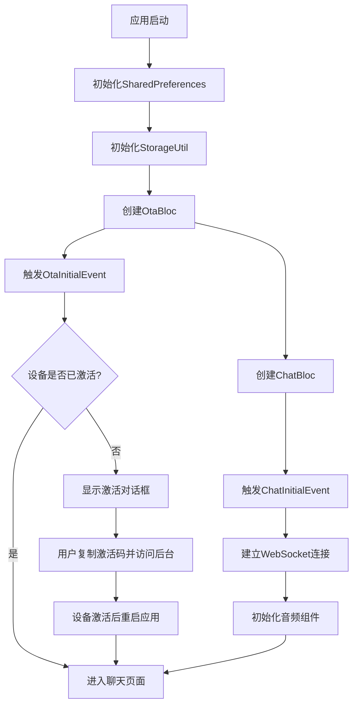
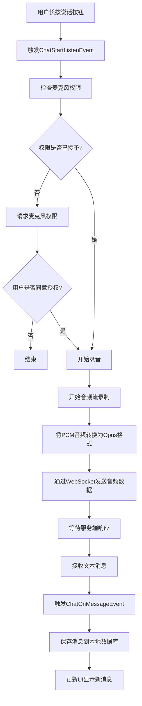
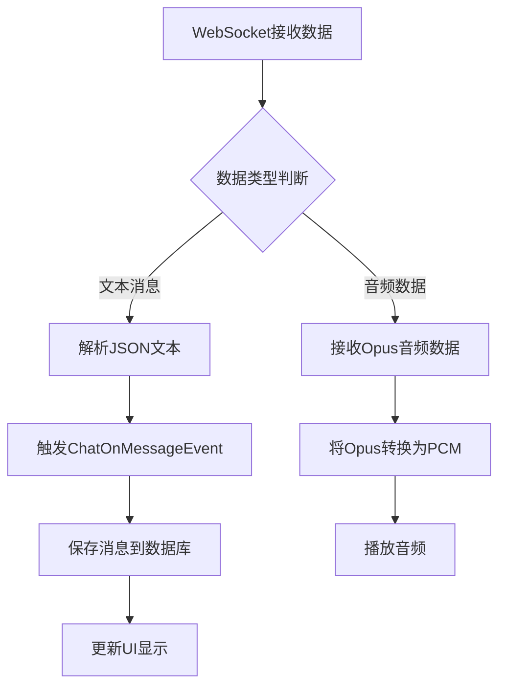
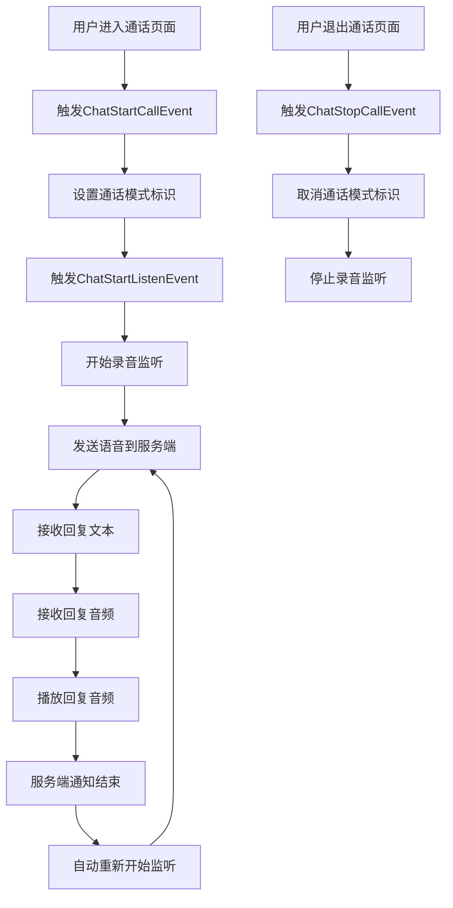

# Xiaozhi 项目架构设计文档

## 1. 概述

Xiaozhi 是一个基于 Flutter 的跨平台移动应用，用于通过 WebSocket 协议与 AI 助手进行语音交互。本项目采用 BLoC 架构模式进行状态管理，实现了聊天、通话和设备配置等核心功能。

## 2. 整体架构图

```
┌─────────────────────────────────────────────────────────────┐
│                         Presentation Layer                  │
│  ┌─────────────┐  ┌─────────────┐  ┌─────────────┐         │
│  │  ChatPage   │  │  CallPage   │  │ SettingPage │         │
│  └─────────────┘  └─────────────┘  └─────────────┘         │
├─────────────────────────────────────────────────────────────┤
│                         Business Logic Layer                │
│                                                             │
│  ┌────────────────────┐  ┌────────────────────┐            │
│  │     ChatBloc       │  │      OtaBloc       │            │
│  │                    │  │                    │            │
│  │ - 处理语音消息     │  │ - 设备激活逻辑     │            │
│  │ - WebSocket通信    │  │ - OTA更新          │            │
│  │ - 音频录制播放     │  │                    │            │
│  └────────────────────┘  └────────────────────┘            │
├─────────────────────────────────────────────────────────────┤
│                         Data Layer                          │
│                                                             │
│  ┌────────────────────┐  ┌────────────────────┐            │
│  │   StorageUtil      │  │ SharedPreferences  │            │
│  │                    │  │                    │            │
│  │ - SQLite数据库操作 │  │ - 本地配置存储     │            │
│  │ - 消息持久化       │  │ - 用户偏好设置     │            │
│  └────────────────────┘  └────────────────────┘            │
└─────────────────────────────────────────────────────────────┘
```

## 3. 模块详解

### 3.1 UI 层 (Presentation Layer)

#### 3.1.1 ChatPage (聊天页面)
- 主要交互界面，提供按住说话功能
- 显示历史消息记录
- 支持下拉加载更多消息
- 处理用户输入事件

#### 3.1.2 CallPage (通话页面)
- 提供连续通话模式
- 显示当前对话内容
- 提供通话控制界面

#### 3.1.3 SettingPage (设置页面)
- 配置 OTA 地址
- 配置 WebSocket 地址
- 配置设备 MAC 地址

### 3.2 业务逻辑层 (Business Logic Layer)

#### 3.2.1 ChatBloc
负责处理所有与聊天相关的业务逻辑：

##### 核心功能：
1. WebSocket 连接管理
2. 音频录制与播放控制
3. 消息处理与分发
4. 权限管理

##### 主要事件：
- `ChatInitialEvent`: 初始化聊天功能
- `ChatStartListenEvent`: 开始录音监听
- `ChatOnMessageEvent`: 接收新消息
- `ChatLoadMoreEvent`: 加载更多历史消息
- `ChatStopListenEvent`: 停止录音监听
- `ChatStartCallEvent`: 开始通话模式
- `ChatStopCallEvent`: 结束通话模式

##### 状态管理：
- `ChatInitialState`: 初始状态，包含消息列表和加载状态
- `ChatNoMicrophonePermissionState`: 缺少麦克风权限状态

#### 3.2.2 OtaBloc
负责处理设备激活相关的业务逻辑：

##### 核心功能：
1. 设备激活验证
2. OTA 更新检查
3. 激活码显示与处理

##### 主要事件：
- `OtaInitialEvent`: 初始化 OTA 功能

##### 状态管理：
- `OtaActivatedState`: 设备已激活状态
- `OtaNotActivatedState`: 设备未激活状态，包含激活码和 URL

### 3.3 数据层 (Data Layer)

#### 3.3.1 StorageUtil
负责本地数据存储管理：

##### 核心功能：
1. SQLite 数据库操作
2. 聊天消息的持久化存储
3. 分页查询历史消息

#### 3.3.2 SharedPreferencesUtil
负责应用配置和用户偏好的存储：

##### 核心功能：
1. 存储 OTA 地址配置
2. 存储 WebSocket 地址配置
3. 存储设备 MAC 地址

## 4. 核心流程图

### 4.1 应用启动流程



### 4.2 消息发送流程



### 4.3 消息接收流程



### 4.4 连续通话流程



## 5. 技术栈

### 5.1 核心框架
- Flutter 3.x
- Dart 3.x
- BLoC 状态管理

### 5.2 第三方库
- `flutter_bloc`: 状态管理
- `web_socket_channel`: WebSocket 通信
- `record`: 音频录制
- `opus_flutter`/`opus_dart`: Opus 音频编解码
- `shared_preferences`: 本地数据存储
- `sqflite`: SQLite 数据库
- `pull_to_refresh_flutter3`: 下拉刷新组件
- `dio`: HTTP 请求库
- `permission_handler`: 权限管理
- `url_launcher`: URL 跳转

## 6. 数据模型

### 6.1 StorageMessage (本地存储消息)
- `id`: 消息唯一标识
- `text`: 消息文本内容
- `sendByMe`: 是否由当前用户发送
- `createdAt`: 创建时间

### 6.2 WebsocketMessage (WebSocket 消息)
- `type`: 消息类型（hello、listen、speech_to_text、text_to_speech等）
- `transport`: 传输方式
- `sessionId`: 会话ID
- `state`: 状态（start、stop等）
- `mode`: 模式（auto等）
- `text`: 文本内容
- `audioParams`: 音频参数

## 7. 音频处理流程

```
录音阶段:
麦克风输入 → PCM音频数据 → Opus编码 → WebSocket传输

播放阶段:
WebSocket接收Opus数据 → Opus解码 → PCM音频数据 → 扬声器输出
```

## 8. 状态管理策略

本项目使用 BLoC (Business Logic Component) 模式进行状态管理：

1. **事件驱动**: UI 层通过 dispatch 事件来触发状态变更
2. **单一数据源**: 每个页面的数据都来源于对应的 BLoC
3. **响应式更新**: 状态变化时自动更新 UI
4. **业务隔离**: 不同业务模块使用独立的 BLoC

## 9. 本地化支持

项目支持中英文两种语言，通过 Flutter 的国际化机制实现：
- 使用 `intl` 包管理翻译文本
- 自动生成本地化代码
- 支持运行时语言切换

## 10. 总结

Xiaozhi 项目采用了清晰的分层架构设计，各层之间职责明确，便于维护和扩展。通过 BLoC 模式有效管理复杂的状态逻辑，结合 WebSocket 实现实时通信，为用户提供流畅的语音交互体验。